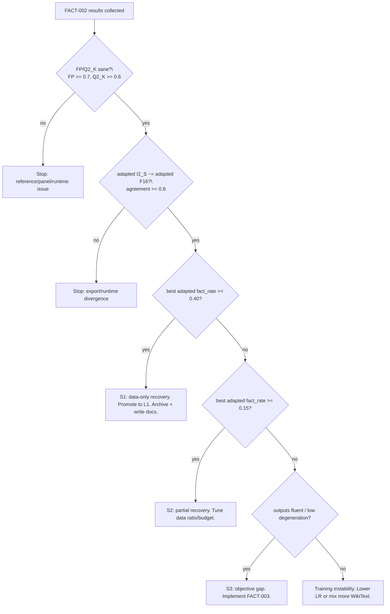

# Factual Recovery Master Runbook (RT-131..134)

Document position: [Index](./index.md) -> after
[Factual Gap Experiment Plan](./factual_gap_experiment_plan.md).

This is the single-flight execution document for the remaining quality question:

```text
Can teacher-free b1.58 adaptation keep the speed/storage win while preserving
basic factual behavior close to FP/Q2_K?
```

RT-130 already answered the diagnostic question:

```text
The current WikiText-CE adapted model is fluent but factually weak.
FP f16 fact_rate 0.81, Q2_K 0.74, adapted I2_S 0.04.
adapted I2_S ~= adapted F16, so runtime/export is not the problem.
```

Therefore this runbook does **not** revisit quantizer design, rotation, GLM, gpt-oss,
or custom kernels. It runs the data/objective branch to the end, with explicit
stop/go criteria at every checkpoint.

## Locked Context

Do not spend GPU on a new idea unless it preserves these locked facts:

| axis | status | implication |
| --- | --- | --- |
| I2_S runtime/export | solved | if adapted F16 is good, adapted I2_S should match it |
| storage/speed | solved | I2_S is the systems substrate |
| one-shot PTQ | failed | pure conversion without adaptation is not enough |
| quantizer tweaks | ruled out | RT-124..127: PTQ toolbox is not the main lever |
| decoding collapse | rescued | use rep-penalty/sampling; greedy is diagnostic only |
| factuality | open | RT-130 says WikiText CE forgot facts |

The next lever is:

```text
adaptation data / objective
```

not:

```text
new codebook, mixed-bit DP, complex rotation, MoE/gpt-oss, or Mac runtime work
```

Complex/phase rotation remains a later candidate idea in
[Complex / Phase Rotation Candidate Note](./complex_phase_rotation_plan.md). Run it
only after the data/objective branch below has a clear result.

## End States

This runbook should end in one of four states.

| end state | condition | conclusion | next action |
| --- | --- | --- | --- |
| S1: data-only recovery | mixed/instruction adapted I2_S fact_rate >= 0.40, degeneration low, I2_S ~= F16 | FACT-002 succeeds; claim can move from L0 to L1 | write result; optionally scale budget/seed |
| S2: partial data recovery | fact_rate 0.15..0.40 or strong improvement over 0.04 | data helps but is not enough | tune data mix/budget before objective work |
| S3: objective gap | fact_rate remains < 0.15 while outputs are fluent | CE-only objective is insufficient | implement FACT-003 repetition/free-run/objective branch |
| S4: runtime divergence | adapted I2_S and adapted F16 disagree materially | unexpected runtime/export issue | stop and debug export, do not train more |

Promotion levels for paper claims:

| level | factual claim |
| --- | --- |
| L0 | non-degenerate only; factual gap open |
| L1 | simple factual panel materially recovered, but below FP/Q2_K |
| L2 | adapted I2_S approaches Q2_K on this fixed panel |
| L3 | benchmark-level factual recovery; outside the current runbook |

Current RT-130 state is L0.

## Non-Negotiable Rules

1. **Never train on `data/factual_panel_v1.jsonl`.**
   It is an evaluation panel, not training data.
2. **Use the same factual panel across all arms.**
   Changing the panel after seeing outputs invalidates the comparison.
3. **Use sane decoding as the primary result.**
   Primary: `--temp 0 --repeat-penalty 1.2`.
   Greedy is diagnostic only.
4. **Always compare adapted F16 and adapted I2_S.**
   If they disagree, the model-quality conclusion is invalid.
5. **Keep the recipe fixed while testing data.**
   Target linears only, same STE, same budget. Change data first, not everything.
6. **Archive JSON and markdown results.**
   No result enters paper docs without a committed JSON/MD artifact or a reproduced
   table.

## Required Artifacts

Expected Colab/Linux layout:

```text
/content/bnt
  BitNet-Transformers clone

/content/bitnet.cpp
  microsoft/BitNet clone built with I2_S support
  build/bin/llama-cli
  build/bin/llama-quantize
  build/bin/llama-perplexity
  utils/convert-hf-to-gguf-bitnet.py

/content/bnt_runs
  tinyllama_fact002_wikitext      optional re-run of RT-120 baseline
  tinyllama_fact002_instr         FACT-002C
  tinyllama_fact002_mixed         FACT-002D

/content/bitnet.cpp/models/rt122_panel
  fp/ggml-model-f16.gguf
  fp/ggml-model-q2_k.gguf
  ptq/ggml-model-i2_s.gguf
```

The `rt122_panel` directory is used by `scripts/rt130_factual_gap_panel.py` as
reference FP/Q2_K/PTQ inputs.

## Implementation Map

The first FACT-002 pass should require **no new code** if the current scripts are on
`origin/main`. If an arm or branch asks for behavior that is not yet supported, implement
only the smallest named work packet below.

| file | current responsibility | edit only when |
| --- | --- | --- |
| `scripts/rt116_quality_recovery.py` | b1.58 STE adaptation, `--train-source {wikitext,instruction,mixed}`, GGUF export | adding data-ratio arms, objective variants, loss masks, replay/KL, or extra JSON fields |
| `scripts/rt130_factual_gap_panel.py` | fixed factual panel scoring, decode configs, F16/I2_S agreement | adding a scorer metric or extra variants; do **not** change primary panel semantics mid-run |
| `data/factual_panel_v1.jsonl` | fixed FACT-001/002 eval panel | never edit during this run; create `data/factual_panel_v2_candidate.jsonl` only for future work |
| `docs/factual_recovery_master_runbook.md` | live execution contract and branch decision tree | update when an execution condition or branch is changed |
| `docs/factual_gap_experiment_plan.md` | research narrative and final FACT result summaries | append RT-131/132/133 results after JSON exists |
| `docs/paper_draft.md` | paper-style interpretation | update only after a branch reaches S1/S2/S3/S4 |
| `docs/paper_skeleton.md` | claim table and gap audit | update with final claim level after result |
| `docs/index.md` | reading order and current next step | update after each major branch decision |
| `docs/colab_validation_summary.md` | compact external-run archive | update if raw JSON is committed or pasted |
| `reports/rt131_*.json`, `reports/rt131_*.md` | immutable run artifacts | write one JSON and one MD per arm/score pass |

### Work Packet I0: supported FACT-002 data arms

Use this path first. It uses existing code:

```text
scripts/rt116_quality_recovery.py --train-source instruction
scripts/rt116_quality_recovery.py --train-source mixed
scripts/rt130_factual_gap_panel.py
```

Acceptance:

```text
instruction and mixed arms both train to completion
each arm exports f16 and i2_s GGUF
each arm has train JSON + fact JSON + fact markdown
adapted I2_S/F16 agreement is reported
```

### Work Packet I1: data-ratio arms, only if S2

Condition:

```text
FACT-002 improves facts but stays in 0.15 <= fact_rate < 0.40.
```

Implement in `scripts/rt116_quality_recovery.py`:

1. Add an argument:

   ```text
   --instruction-ratio FLOAT
   ```

   Valid only with `--train-source mixed`. Default should preserve current behavior
   (`0.5` instruction / `0.5` WikiText).

2. Modify `load_corpus()` so mixed mode uses:

   ```text
   instr_cap = int(max_train_tokens * instruction_ratio)
   wiki_cap = max_train_tokens - instr_cap
   train = concat(instr[:instr_cap], wt_train[:wiki_cap])
   ```

3. Add these fields to the JSON result:

   ```text
   train_source
   instruction_ratio
   instruction_tokens
   wikitext_tokens
   ```

4. Add a 2-step smoke command to this document before launching 800 steps.

Acceptance:

```text
python scripts/rt116_quality_recovery.py --train-source mixed --instruction-ratio 0.7 --steps 2 ...
returns rc=0
JSON records instruction_ratio=0.7
FACT panel file is not read by the training loader
```

Never implement ratio control in a separate ad hoc notebook; put it in
`scripts/rt116_quality_recovery.py` so the result is reproducible.

### Work Packet I2: FACT-003 objective branch, only if S3

Condition:

```text
FACT-002 instruction/mixed arms remain fact_rate < 0.15 while outputs are fluent and
I2_S ~= F16.
```

Implement in `scripts/rt116_quality_recovery.py`, behind explicit flags. Do not turn
these on by default.

Candidate flags:

| flag | behavior | acceptance |
| --- | --- | --- |
| `--answer-loss-only` | mask loss to answer spans for instruction data | train smoke works; JSON records enabled flag |
| `--base-kl-weight FLOAT` | preserve base logits on non-eval prompts with a small KL term | KL term reported separately; no FACT panel leakage |
| `--repetition-loss-weight FLOAT` | add a lightweight repeated-token/ngram penalty on short generated spans | loss components reported; generation panel improves without factual regression |
| `--protected-replay-path PATH` | optional factual replay set unrelated to FACT-001 | file hash recorded; overlap check vs `data/factual_panel_v1.jsonl` passes |

Required implementation shape:

```text
main training loss = CE + optional_objective_terms
JSON must include each objective term and its weight
default behavior with all flags off must match RT-116/120/131
```

Acceptance before a full run:

```text
2-step smoke on TinyLlama
loss finite
JSON written
GGUF export still works with --bitnet
rt130 still scores adapted f16/i2_s
```

### Work Packet I3: scoring extensions, only if needed

Condition:

```text
FACT-002 changes output style enough that contains-match is too brittle, while manual
inspection suggests the model is often correct.
```

Implement in `scripts/rt130_factual_gap_panel.py`:

1. Add an optional `--save-raw-generations PATH`.
2. Add extra non-primary metrics only as additional fields:

   ```text
   exact_contains_hit
   normalized_contains_hit
   manual_review_needed
   ```

3. Do not replace `fact_rate` or the existing `must_contain` primary metric in the
   same experiment. New metrics are diagnostic until a later plan revision.

Acceptance:

```text
old JSON keys remain present
old fact_rate table still prints
new raw generations are written
```

### Work Packet I4: documentation implementation

Whenever an implementation packet is used, update docs in the same PR/commit:

| implementation | required doc updates |
| --- | --- |
| I1 ratio arms | this runbook Stage 2/Branch S2 commands, `factual_gap_experiment_plan.md` |
| I2 objective branch | this runbook Branch S3, `quality_recovery_plan.md`, `paper_skeleton.md` gap table |
| I3 scoring extensions | this runbook Stage 3, `factual_gap_experiment_plan.md`, `paper_draft.md` limitations |

Do not leave implementation-only commits without a run command and an acceptance
criterion in docs.

## Stage 0: Fresh Runtime Preflight

Run this before any expensive training.

```bash
set -euo pipefail

cd /content
if [ ! -d /content/bnt ]; then
  git clone https://github.com/gtpk/BitNet-Transformers /content/bnt
fi
cd /content/bnt
git fetch origin
git reset --hard origin/main

python - <<'PY'
import torch, sys
print("python", sys.version)
print("cuda", torch.cuda.is_available())
if torch.cuda.is_available():
    print("gpu", torch.cuda.get_device_name(0))
    print("mem", torch.cuda.mem_get_info())
PY

python - <<'PY'
from pathlib import Path
need = [
    "scripts/rt116_quality_recovery.py",
    "scripts/rt122_prompt_panel_gguf.py",
    "scripts/rt130_factual_gap_panel.py",
    "data/factual_panel_v1.jsonl",
]
missing = [p for p in need if not Path(p).exists()]
print("missing", missing)
assert not missing
PY
```

Install Python dependencies if the runtime is fresh:

```bash
pip install -q transformers datasets safetensors sentencepiece accelerate \
  bitsandbytes huggingface_hub
```

Check bitnet.cpp:

```bash
test -x /content/bitnet.cpp/build/bin/llama-cli
test -x /content/bitnet.cpp/build/bin/llama-quantize
test -x /content/bitnet.cpp/build/bin/llama-perplexity
test -f /content/bitnet.cpp/utils/convert-hf-to-gguf-bitnet.py
```

If the bitnet.cpp checks fail, build it with the known-good x86 path:

```bash
cd /content
rm -rf /content/bitnet.cpp
git clone https://github.com/microsoft/BitNet.git /content/bitnet.cpp
cd /content/bitnet.cpp
git checkout 01eb415772c342d9f20dc42772f1583ae1e5b102
git submodule update --init --recursive
pip install -q cmake sentencepiece huggingface_hub
python setup_env.py -hr 1bitLLM/bitnet_b1_58-large -q i2_s
```

Known x86 gotcha: `setup_env.py -q i2_s` is preferred over a bare cmake configure,
because it wires the generated `bitnet-lut-kernels.h` include correctly.

## Stage 1: Baseline Reference Prep

Use the old RT-120 WikiText adapted checkpoint if it exists. If it does not exist,
recreate it exactly enough for comparison.

```bash
cd /content/bnt
BASE=/content/bnt_runs/tinyllama_g1_l4_s800_b4x6

if [ ! -f "$BASE/config.json" ]; then
  python scripts/rt116_quality_recovery.py \
    --model-id TinyLlama/TinyLlama-1.1B-Chat-v1.0 \
    --train-source wikitext \
    --steps 800 \
    --seq-len 256 \
    --batch 4 \
    --grad-accum-steps 6 \
    --lr 2e-4 \
    --max-train-tokens 2000000 \
    --max-eval-tokens 60000 \
    --ppl-eval-tokens 3000 \
    --dtype float32 \
    --optim adamw8bit \
    --grad-checkpointing \
    --bitnet /content/bitnet.cpp \
    --out-dir "$BASE" \
    --json-out reports/rt131_fact002_wikitext_rebuilt.json \
    --log-every 25
fi
```

Build/reuse FP, Q2_K, and PTQ I2_S references:

```bash
python scripts/rt122_prompt_panel_gguf.py \
  --bitnet /content/bitnet.cpp \
  --model-id TinyLlama/TinyLlama-1.1B-Chat-v1.0 \
  --adapted-dir "$BASE" \
  --work /content/bitnet.cpp/models/rt122_panel \
  --out reports/rt131_refprep_prompt_panel.md \
  --threads 8
```

This command also runs a prompt panel, but its important side effect here is:

```text
/content/bitnet.cpp/models/rt122_panel/fp/ggml-model-f16.gguf
/content/bitnet.cpp/models/rt122_panel/fp/ggml-model-q2_k.gguf
/content/bitnet.cpp/models/rt122_panel/ptq/ggml-model-i2_s.gguf
```

Re-score the known bad WikiText adapted baseline:

```bash
python scripts/rt130_factual_gap_panel.py \
  --bitnet /content/bitnet.cpp \
  --adapted-dir "$BASE" \
  --refs-dir /content/bitnet.cpp/models/rt122_panel/fp \
  --ptq-gguf /content/bitnet.cpp/models/rt122_panel/ptq/ggml-model-i2_s.gguf \
  --prompt-file data/factual_panel_v1.jsonl \
  --threads 8 \
  --json-out reports/rt131_fact002_wikitext_fact.json \
  --markdown-out reports/rt131_fact002_wikitext_fact.md
```

Expected sanity:

```text
FP f16 fact_rate around 0.8
Q2_K fact_rate around 0.7
adapted i2_s fact_rate around 0.0..0.1
adapted i2_s vs f16 agreement high
```

If FP/Q2_K are low, stop. The panel or runtime is broken.

## Stage 2: FACT-002 Data-Only Adaptation Arms

Run two primary arms:

| arm | train source | hypothesis |
| --- | --- | --- |
| C | instruction | factual/instruction data restores facts |
| D | mixed | instruction restores facts while WikiText preserves LM style |

Both use the same budget as RT-120:

```text
steps=800
seq_len=256
microbatch=4
grad_accum=6
effective_batch=24
effective tokens ~= 4.92M
target linears only
fp32 model compute
AdamW8bit optimizer
grad checkpointing
```

Instruction-only:

```bash
python scripts/rt116_quality_recovery.py \
  --model-id TinyLlama/TinyLlama-1.1B-Chat-v1.0 \
  --train-source instruction \
  --steps 800 \
  --seq-len 256 \
  --batch 4 \
  --grad-accum-steps 6 \
  --lr 2e-4 \
  --max-train-tokens 2000000 \
  --max-eval-tokens 60000 \
  --ppl-eval-tokens 3000 \
  --dtype float32 \
  --optim adamw8bit \
  --grad-checkpointing \
  --bitnet /content/bitnet.cpp \
  --out-dir /content/bnt_runs/tinyllama_fact002_instr \
  --json-out reports/rt131_fact002_instr_train.json \
  --log-every 25
```

Mixed:

```bash
python scripts/rt116_quality_recovery.py \
  --model-id TinyLlama/TinyLlama-1.1B-Chat-v1.0 \
  --train-source mixed \
  --steps 800 \
  --seq-len 256 \
  --batch 4 \
  --grad-accum-steps 6 \
  --lr 2e-4 \
  --max-train-tokens 2000000 \
  --max-eval-tokens 60000 \
  --ppl-eval-tokens 3000 \
  --dtype float32 \
  --optim adamw8bit \
  --grad-checkpointing \
  --bitnet /content/bitnet.cpp \
  --out-dir /content/bnt_runs/tinyllama_fact002_mixed \
  --json-out reports/rt131_fact002_mixed_train.json \
  --log-every 25
```

OOM branch:

```text
If CUDA OOM:
  batch 4, accum 6 -> batch 3, accum 8
  or batch 2, accum 12
Keep effective batch near 24 before reducing steps.
Do not change lr and data source at the same time.
```

Dataset download branch:

```text
If databricks/databricks-dolly-15k fails:
  stop and fix dataset access.
Do NOT use data/factual_panel_v1.jsonl as a training substitute.
Do NOT hand-write training answers copied from the eval panel.
```

## Stage 3: Score Every Adapted Arm

Instruction-only:

```bash
python scripts/rt130_factual_gap_panel.py \
  --bitnet /content/bitnet.cpp \
  --adapted-dir /content/bnt_runs/tinyllama_fact002_instr \
  --refs-dir /content/bitnet.cpp/models/rt122_panel/fp \
  --ptq-gguf /content/bitnet.cpp/models/rt122_panel/ptq/ggml-model-i2_s.gguf \
  --prompt-file data/factual_panel_v1.jsonl \
  --threads 8 \
  --json-out reports/rt131_fact002_instr_fact.json \
  --markdown-out reports/rt131_fact002_instr_fact.md
```

Mixed:

```bash
python scripts/rt130_factual_gap_panel.py \
  --bitnet /content/bitnet.cpp \
  --adapted-dir /content/bnt_runs/tinyllama_fact002_mixed \
  --refs-dir /content/bitnet.cpp/models/rt122_panel/fp \
  --ptq-gguf /content/bitnet.cpp/models/rt122_panel/ptq/ggml-model-i2_s.gguf \
  --prompt-file data/factual_panel_v1.jsonl \
  --threads 8 \
  --json-out reports/rt131_fact002_mixed_fact.json \
  --markdown-out reports/rt131_fact002_mixed_fact.md
```

Collect the summary:

```bash
python - <<'PY'
import json, math
from pathlib import Path

rows = []
for name in ["wikitext", "instr", "mixed"]:
    fact_path = Path(f"reports/rt131_fact002_{name}_fact.json")
    train_path = Path(f"reports/rt131_fact002_{name}_train.json")
    if not fact_path.exists():
        continue
    fact = json.loads(fact_path.read_text())
    agg = fact["agg"]
    adapted = agg.get("adapted i2_s|rep1.2", {})
    f16 = agg.get("adapted f16|rep1.2", {})
    q2k = agg.get("Q2_K|rep1.2", {})
    fp = agg.get("FP f16|rep1.2", {})
    train = json.loads(train_path.read_text()) if train_path.exists() else {}
    qr3 = train.get("qr003", {})
    rows.append({
        "arm": name,
        "fp_fact": fp.get("fact_rate"),
        "q2k_fact": q2k.get("fact_rate"),
        "adapted_i2s_fact": adapted.get("fact_rate"),
        "adapted_f16_fact": f16.get("fact_rate"),
        "i2s_f16_agreement": fact.get("agreement"),
        "tags": adapted.get("tags"),
        "ce_adapted": train.get("ce_adapted"),
        "ppl_adapted": train.get("ppl_adapted"),
        "recovered_fraction": train.get("recovered_fraction"),
        "qr003_i2s_vs_f16_nats": qr3.get("i2s_vs_f16_nats"),
    })

print("| arm | fact_i2s | fact_f16 | agreement | adapted PPL | recovered | tags |")
print("| --- | ---: | ---: | --- | ---: | ---: | --- |")
for r in rows:
    print(f"| {r['arm']} | {r['adapted_i2s_fact']} | {r['adapted_f16_fact']} | "
          f"{r['i2s_f16_agreement']} | {r['ppl_adapted']} | {r['recovered_fraction']} | {r['tags']} |")
PY
```

## Stage 4: Decision Tree

Use this exact decision tree before launching another GPU run.



Detailed branches:

### Branch S1: data-only recovery

Criteria:

```text
best adapted I2_S fact_rate >= 0.40
adapted I2_S vs adapted F16 agreement >= 0.80
degeneration tags mostly ok/repetitive, not salad/empty
QR-003 |i2_s - f16| <= 0.05 nats if available
```

Then:

1. Choose the better default recipe:
   - `mixed` if it is within 0.05 fact_rate of instruction-only and has better CE/PPL.
   - `instruction` if it clearly wins fact_rate and does not degenerate.
2. Update:
   - [Factual Gap Experiment Plan](./factual_gap_experiment_plan.md)
   - [Quality Recovery Plan](./quality_recovery_plan.md)
   - [Paper Draft](./paper_draft.md)
   - [Paper Skeleton](./paper_skeleton.md)
   - [Index](./index.md)
3. Claim level becomes L1:

```text
basic factual behavior materially recovered under fixed FACT-001 panel
```

Do not claim factual parity unless the result is close to Q2_K.

### Branch S2: partial recovery

Criteria:

```text
0.15 <= best fact_rate < 0.40
```

Then run the cheapest ratio/budget refinement, not a new algorithm:

| next arm | change | reason |
| --- | --- | --- |
| D70 | 70% instruction / 30% WikiText | if instruction wins facts but loses CE/style |
| D30 | 30% instruction / 70% WikiText | if mixed preserves style but not enough facts |
| D-long | same best data, 1200 steps | if fact_rate is rising and train CE still descending |

Current `rt116_quality_recovery.py` supports only `instruction` and `mixed` fixed
sources. If ratio arms are needed, implement ratio control before running them.

Stop if two ratio/budget attempts stay below 0.40. Then move to FACT-003.

### Branch S3: objective gap

Criteria:

```text
best fact_rate < 0.15
outputs are fluent/non-degenerate
I2_S ~= F16
```

Interpretation:

```text
The model can speak, but CE-on-demonstrations does not preserve answer behavior.
This is no longer a bit/codebook problem.
```

FACT-003 objective candidates, in order:

| candidate | idea | why | status |
| --- | --- | --- | --- |
| answer-only loss mask (FACT-003A) | CE on response tokens only in instruction data | avoid overfitting prompt formatting | **IMPLEMENTED** `rt116 --answer-loss-only` |
| base-KL replay (FACT-003B) | mix a small base-output KL on non-eval prompts | preserve base answer distribution without full distillation | not yet (needs code) |
| protected factual replay (FACT-003C) | small training set of facts not overlapping FACT-001 + leakage check | test whether facts can be retained without eval leakage | not yet (needs code) |
| repetition/free-run penalty | penalize repeated n-grams during short rollouts | reduce decoding-policy dependence | not yet (needs code) |

FACT-003A (answer-only loss mask) is now supported: `rt116 --answer-loss-only` tokenizes
instruction data per example and masks prompt+separator tokens to `-100` so CE counts
response tokens only (WikiText content always counts). Run it first. FACT-003B/C still
require code changes — do not pretend they are supported by `rt116`.

### Branch S4: runtime divergence

Criteria:

```text
adapted F16 fact_rate materially differs from adapted I2_S
or adapted I2_S/F16 hit agreement < 0.80
```

Then:

1. Check that adapted GGUFs were regenerated after the latest checkpoint.
2. Re-run `rt116` with `--bitnet` so QR-003 exports happen in one script.
3. Re-run `rt130`.
4. If divergence persists, stop quality experiments and debug export/runtime.

This is not expected after RT-111/112/120/130.

## Stage 4B: Result-Conditioned Next Procedures

After Stage 4 assigns S1/S2/S3/S4, do not improvise. Execute the matching procedure
below.

### If S1: data-only recovery succeeds

S1 means:

```text
instruction or mixed adapted I2_S fact_rate >= 0.40
adapted I2_S ~= adapted F16
degeneration low
```

Next procedure:

1. **Freeze the winning recipe.**

   ```text
   default recipe = winner of instruction vs mixed
   no new quantizer/codebook/rotation work
   ```

2. **Run one confirmation pass.**

   Same recipe, same budget, different seed:

   ```bash
   python scripts/rt116_quality_recovery.py \
     --model-id TinyLlama/TinyLlama-1.1B-Chat-v1.0 \
     --train-source <winner> \
     --steps 800 \
     --seq-len 256 \
     --batch 4 \
     --grad-accum-steps 6 \
     --lr 2e-4 \
     --max-train-tokens 2000000 \
     --max-eval-tokens 60000 \
     --ppl-eval-tokens 3000 \
     --seed 1 \
     --dtype float32 \
     --optim adamw8bit \
     --grad-checkpointing \
     --bitnet /content/bitnet.cpp \
     --out-dir /content/bnt_runs/tinyllama_fact002_<winner>_seed1 \
     --json-out reports/rt132_fact002_<winner>_seed1_train.json \
     --log-every 25
   ```

3. **Score the confirmation pass with RT-130.**

   ```bash
   python scripts/rt130_factual_gap_panel.py \
     --bitnet /content/bitnet.cpp \
     --adapted-dir /content/bnt_runs/tinyllama_fact002_<winner>_seed1 \
     --refs-dir /content/bitnet.cpp/models/rt122_panel/fp \
     --ptq-gguf /content/bitnet.cpp/models/rt122_panel/ptq/ggml-model-i2_s.gguf \
     --prompt-file data/factual_panel_v1.jsonl \
     --threads 8 \
     --json-out reports/rt132_fact002_<winner>_seed1_fact.json \
     --markdown-out reports/rt132_fact002_<winner>_seed1_fact.md
   ```

4. **Review S1 robustness.**

   Pass if:

   ```text
   seed0 and seed1 both improve over WikiText baseline by >= 0.20 fact_rate
   both stay below FP/Q2_K but materially above 0.04
   I2_S/F16 agreement >= 0.80 in both
   no salad/empty dominance
   ```

5. **Promote the claim carefully.**

   Allowed:

   ```text
   teacher-free b1.58 adaptation can recover basic factual behavior on a fixed
   hand-checkable panel when adaptation data matches answer style.
   ```

   Not allowed:

   ```text
   factual parity with FP/Q2_K
   benchmark-level factual quality
   quality-per-bit superiority
   ```

6. **Optional next only after write-up:** run the same winning recipe at 1200 steps if
   the train loss is still descending and fact_rate is below Q2_K by a large margin.

### If S2: partial recovery

S2 means:

```text
0.15 <= best fact_rate < 0.40
```

Next procedure:

1. **Inspect which arm won.**

   | observation | next arm |
   | --- | --- |
   | instruction fact_rate > mixed, but worse CE/style | D70: 70% instruction / 30% WikiText |
   | mixed better CE/style, facts still low | D30: 30% instruction / 70% WikiText |
   | both arms improve facts and train loss still falling | D-long: 1200 steps on the better arm |

2. **Implement I1 if ratio arms are needed.**

   File:

   ```text
   scripts/rt116_quality_recovery.py
   ```

   Required flag:

   ```text
   --instruction-ratio FLOAT
   ```

3. **Run a 2-step smoke before a full ratio run.**

   ```bash
   python scripts/rt116_quality_recovery.py \
     --model-id TinyLlama/TinyLlama-1.1B-Chat-v1.0 \
     --train-source mixed \
     --instruction-ratio 0.7 \
     --steps 2 \
     --seq-len 256 \
     --batch 1 \
     --grad-accum-steps 1 \
     --lr 2e-4 \
     --max-train-tokens 8192 \
     --max-eval-tokens 4096 \
     --ppl-eval-tokens 256 \
     --dtype float32 \
     --optim adamw8bit \
     --grad-checkpointing \
     --bitnet /content/bitnet.cpp \
     --out-dir /content/bnt_smoke/tinyllama_fact002_ratio_smoke \
     --json-out reports/rt132_fact002_ratio_smoke.json
   ```

4. **Run at most two refinement arms before changing objective.**

   Recommended order:

   ```text
   D70 or D30, chosen by observation
   then D-long only if the first refinement improves
   ```

5. **Stop condition.**

   If two refinements remain below `0.40`, stop data-only tuning and go to S3/FACT-003.

Review checklist for S2:

```text
Was the improvement real or just a scoring artifact?
Did fact_rate improve at the cost of degeneration?
Did adapted F16 improve along with adapted I2_S?
Did CE/PPL collapse while facts improved?
Was the factual panel still untouched by training?
```

### If S3: objective gap

S3 means:

```text
best fact_rate < 0.15
outputs are fluent
I2_S ~= F16
```

Next procedure:

1. **Write the S3 verdict before implementing objectives.**

   Update:

   ```text
   docs/factual_gap_experiment_plan.md
   docs/paper_skeleton.md
   docs/index.md
   ```

   State clearly:

   ```text
   data swap alone did not preserve factual behavior; the next lever is objective.
   ```

2. **Implement one objective at a time in `scripts/rt116_quality_recovery.py`.**

   Priority order:

   | order | objective | reason | status |
   | ---: | --- | --- | --- |
   | 1 | answer-only loss mask (FACT-003A) | cheapest; may stop prompt-format overfitting | **DONE** `--answer-loss-only` |
   | 2 | base-KL replay on non-eval prompts (FACT-003B) | preserve base answer distribution | TODO |
   | 3 | protected factual replay set (FACT-003C) | test factual retention without FACT-001 leakage | TODO |
   | 4 | repetition/free-run penalty | only if degeneration returns under sane decoding | TODO |

   FACT-003A run (instruction + mixed, same RT-120 budget; score with rt130 panel,
   compare `fact_rate` to FACT-002 instr 0.00 / mixed 0.07 / Q2_K 0.74 / FP 0.81):

   ```bash
   python scripts/rt116_quality_recovery.py --model-id TinyLlama/TinyLlama-1.1B-Chat-v1.0 \
     --train-source instruction --answer-loss-only --steps 800 --seq-len 256 --batch 4 \
     --grad-accum-steps 6 --lr 2e-4 --max-train-tokens 2000000 --dtype float32 \
     --optim adamw8bit --grad-checkpointing --bitnet /content/bitnet.cpp \
     --out-dir /content/bnt_runs/tinyllama_fact003a_instr \
     --json-out reports/rt132_fact003a_instr_train.json --log-every 25
   # mixed: --train-source mixed --out-dir ..._mixed
   ```

3. **Required code shape.**

   ```text
   default behavior unchanged when flags are off
   each objective has an explicit CLI flag
   each loss component is logged separately
   JSON records objective weights and data sources
   ```

4. **Required no-leakage check.**

   If adding replay/factual data, create a local overlap checker:

   ```text
   scripts/check_fact_panel_overlap.py
   ```

   It must compare the new training source against `data/factual_panel_v1.jsonl` and
   fail if exact question/answer strings overlap.

5. **Run objective smoke.**

   2 steps, `--bitnet`, same as S2 smoke, with the new objective flag.

6. **Full objective run.**

   Use the best FACT-002 data source as the base source. Do not test multiple
   objectives at once until one objective shows a positive signal.

Objective branch review checklist:

```text
Did FACT-001 fact_rate improve over FACT-002 best?
Did repetition/degeneration stay low?
Did WikiText CE/PPL collapse?
Did I2_S preserve F16?
Is the improvement still present under seed 1?
Is there any train/eval leakage?
```

### If S4: runtime/export divergence

S4 means:

```text
adapted I2_S and adapted F16 disagree
```

Next procedure:

1. **Do not train more.**

2. **Regenerate GGUFs from the adapted HF directory.**

   ```bash
   AD=/content/bnt_runs/<suspect_adapted_dir>
   BN=/content/bitnet.cpp
   python "$BN/utils/convert-hf-to-gguf-bitnet.py" "$AD" --outtype f16
   python "$BN/utils/convert-hf-to-gguf-bitnet.py" "$AD" --outtype f32
   "$BN/build/bin/llama-quantize" --token-embedding-type f16 --output-tensor-type f16 \
     "$AD/ggml-model-f32.gguf" "$AD/ggml-model-i2_s.gguf" I2_S 1 1
   ```

3. **Re-run QR-003 PPL parity on `eval.txt`.**

   ```bash
   "$BN/build/bin/llama-perplexity" -m "$AD/ggml-model-f16.gguf" -f "$AD/eval.txt" -c 64 -t 2
   "$BN/build/bin/llama-perplexity" -m "$AD/ggml-model-i2_s.gguf" -f "$AD/eval.txt" -c 64 -t 2
   ```

4. **Re-run RT-130 with the regenerated GGUFs.**

5. **If divergence persists, archive the suspect directory and return to export
   diagnostics.**

Runtime branch review checklist:

```text
Are the GGUF timestamps newer than the HF checkpoint?
Was the model exported from Wq=gamma*T, not latent FP?
Was the x86/Linux bitnet.cpp path used, not the Mac M5 broken runtime?
Does official I2_S still pass in the same runtime?
```

## Stage 4C: Cross-Cutting Review Questions

Before accepting any result, answer these questions in the result markdown:

1. **What exactly improved?**
   fact_rate, degeneration tags, CE/PPL, or only one of them?
2. **What did not improve?**
   Be explicit if Q2_K/FP still dominate.
3. **Is the improvement in adapted F16 too?**
   If only I2_S improves, suspect scoring noise or export artifact.
4. **Did the runtime preserve behavior?**
   Report adapted I2_S vs adapted F16 agreement.
5. **Was the evaluation panel untouched?**
   State "no FACT-001 panel training" in every result summary.
6. **Is this a model-quality claim or a systems claim?**
   Keep systems wins and factual wins separate.
7. **Does this alter the paper claim level?**
   L0/L1/L2/L3 must be named explicitly.

## Stage 5: Archive and Write-Up Checklist

Every completed arm should leave:

```text
reports/rt131_fact002_<arm>_train.json
reports/rt131_fact002_<arm>_fact.json
reports/rt131_fact002_<arm>_fact.md
/content/bnt_runs/tinyllama_fact002_<arm>/config.json
/content/bnt_runs/tinyllama_fact002_<arm>/ggml-model-f16.gguf
/content/bnt_runs/tinyllama_fact002_<arm>/ggml-model-i2_s.gguf
```

After results are known, update docs in this order:

1. [Factual Gap Experiment Plan](./factual_gap_experiment_plan.md): add RT-131 result.
2. [Paper Draft](./paper_draft.md): update Section 5.5 / Limitations / Future Work.
3. [Paper Skeleton](./paper_skeleton.md): update claim table and gap audit.
4. [Index](./index.md): update "Current Status" and next step.
5. [Colab Validation Summary](./colab_validation_summary.md): add compact result table if
   the raw JSON is committed.

Commit message template:

```text
FACT-002: evaluate instruction and mixed-data factual recovery
```

## Documentation Checkpoints During Execution

Do not wait until the very end if a branch changes. Keep the paper trail current.

| checkpoint | when | write/update | minimum content |
| --- | --- | --- | --- |
| D0 preflight | after Stage 0 passes | no paper docs needed; optionally note runtime in `reports/rt131_preflight.txt` | GPU type, bitnet.cpp commit/path, repo commit |
| D1 reference prep | after Stage 1 scores FP/Q2_K/PTQ/baseline | `docs/factual_gap_experiment_plan.md` only if numbers differ materially from RT-130 | FP/Q2_K sanity, baseline fact_rate |
| D2 each training arm | after each `rt116` run | no narrative doc yet; ensure JSON exists | train_source, steps, CE/PPL, recovered_fraction, QR-003 delta |
| D3 each factual score | after each `rt130` run | append temporary table to `reports/rt131_fact002_summary.md` | fact_rate, tags, I2_S/F16 agreement |
| D4 branch decision | after both instruction and mixed are scored | `factual_gap_experiment_plan.md`, `paper_skeleton.md`, `index.md` | S1/S2/S3/S4 verdict and why; selected Stage 4B next procedure |
| D5 paper update | only after D4 | `paper_draft.md`, `colab_validation_summary.md` | claim level, limitation/future-work update, raw artifact paths |

Suggested summary file:

```text
reports/rt131_fact002_summary.md
```

Template:

```markdown
# RT-131 / FACT-002 Summary

Runtime:
- repo commit:
- GPU:
- bitnet.cpp path/commit:

| arm | train_source | fact_i2s | fact_f16 | agreement | adapted PPL | recovered | tags | verdict |
| --- | --- | ---: | ---: | --- | ---: | ---: | --- | --- |
| wikitext | wikitext | | | | | | | baseline |
| instr | instruction | | | | | | | |
| mixed | mixed | | | | | | | |

Decision:

S1/S2/S3/S4:

Next procedure:

Review checklist:
- what improved:
- what did not:
- F16/I2_S agreement:
- no eval leakage:
- claim level:

Next:
```

Commit policy:

```text
If only docs/runbook changed:
  commit as "Plan FACT-002 factual recovery runbook"

If code was implemented:
  commit code + docs + smoke result together.

If full Colab results arrived:
  commit reports + doc result update together.
```

## One-Cell Colab Handoff Prompt

Use this when handing the whole job to an AI agent that can operate Colab. The agent
should not improvise a new research direction.

```text
You are operating in the BitNet-Transformers repository. Do not use the FACT-001
panel for training. Your job is to execute docs/factual_recovery_master_runbook.md
from Stage 0 through Stage 4, then follow the matching Stage 4B next procedure.

Current facts:
- RT-130 found FP f16 fact_rate 0.81, Q2_K 0.74, adapted I2_S 0.04.
- adapted I2_S ~= adapted F16, so the gap is data/objective, not runtime.
- The next experiment is FACT-002: train TinyLlama-1.1B b1.58 with instruction-only
  and mixed data using scripts/rt116_quality_recovery.py, then score both with
  scripts/rt130_factual_gap_panel.py.

Rules:
- Keep the recipe fixed: target linears only, 800 steps, seq_len 256, batch 4,
  grad_accum 6, lr 2e-4, float32, AdamW8bit, grad checkpointing.
- Primary decoding is rep-penalty 1.2 as implemented in rt130.
- Never train on data/factual_panel_v1.jsonl.
- If OOM, reduce microbatch and increase grad accumulation to keep effective batch
  near 24.
- If FP/Q2_K references do not score around 0.7+, stop and debug refs/panel.
- If adapted I2_S diverges from adapted F16, stop and debug export/runtime.
- If current scripts cannot run the requested branch, implement only the named work
  packet from the runbook:
  - I1 for mixed data ratios after S2,
  - I2 for FACT-003 objectives after S3,
  - I3 for scoring extensions only if contains-match is clearly too brittle.
- Put implementation in the listed repo files, not in an ad hoc notebook:
  scripts/rt116_quality_recovery.py for training/data/objectives,
  scripts/rt130_factual_gap_panel.py for scoring,
  docs/factual_recovery_master_runbook.md for run conditions.
- After any implementation, run a 2-step smoke before the full 800-step run.
- Keep reports/rt131_fact002_summary.md updated as each arm finishes.

Deliver:
1. reports/rt131_fact002_instr_train.json
2. reports/rt131_fact002_instr_fact.json and .md
3. reports/rt131_fact002_mixed_train.json
4. reports/rt131_fact002_mixed_fact.json and .md
5. A markdown summary table:
   arm, fact_i2s, fact_f16, i2s/f16 agreement, adapted PPL, recovered_fraction, tags.
6. A verdict using the S1/S2/S3/S4 decision tree in the runbook.
7. The matching Stage 4B next procedure recommendation and the Stage 4C review
   checklist answers.
```

## Copy-Paste Command Prompt

Use this when the operator is not going to read the whole document interactively. It is
intentionally verbose and self-checking. Paste it into a Colab/Linux shell after
selecting a GPU runtime.

It runs:

```text
preflight -> bitnet.cpp check/build -> reference prep -> WikiText baseline score ->
instruction adaptation -> instruction score -> mixed adaptation -> mixed score ->
summary table -> decision hint
```

It does **not** implement S2/S3 code branches automatically. If the final decision is
S2 or S3, return to the Work Packet section above and implement the named packet first.

```bash
set -euo pipefail

echo "== FACT-002 / RT-131 single-flight command prompt =="
echo "This run trains instruction and mixed b1.58 adaptations, then scores the fixed factual panel."
echo "Never train on data/factual_panel_v1.jsonl."

export BNT=/content/bnt
export BITNET=/content/bitnet.cpp
export RUNS=/content/bnt_runs
export PANEL=data/factual_panel_v1.jsonl
export REFS=$BITNET/models/rt122_panel/fp
export PTQ=$BITNET/models/rt122_panel/ptq/ggml-model-i2_s.gguf
export BASE=$RUNS/tinyllama_g1_l4_s800_b4x6
export INSTR=$RUNS/tinyllama_fact002_instr
export MIXED=$RUNS/tinyllama_fact002_mixed

mkdir -p "$RUNS"

echo "== Stage 0: repo + dependencies =="
cd /content
if [ ! -d "$BNT/.git" ]; then
  git clone https://github.com/gtpk/BitNet-Transformers "$BNT"
fi
cd "$BNT"
git fetch origin
git reset --hard origin/main

pip install -q transformers datasets safetensors sentencepiece accelerate bitsandbytes huggingface_hub cmake

python - <<'PY'
import torch, sys
print("python", sys.version)
print("cuda", torch.cuda.is_available())
if torch.cuda.is_available():
    print("gpu", torch.cuda.get_device_name(0))
    print("mem", torch.cuda.mem_get_info())
assert torch.cuda.is_available(), "FACT-002 training needs a GPU runtime"
PY

python - <<'PY'
from pathlib import Path
need = [
    "scripts/rt116_quality_recovery.py",
    "scripts/rt122_prompt_panel_gguf.py",
    "scripts/rt130_factual_gap_panel.py",
    "data/factual_panel_v1.jsonl",
]
missing = [p for p in need if not Path(p).exists()]
print("repo required files missing:", missing)
assert not missing
PY

echo "== Stage 0B: bitnet.cpp check/build =="
if [ ! -x "$BITNET/build/bin/llama-cli" ] || \
   [ ! -x "$BITNET/build/bin/llama-quantize" ] || \
   [ ! -x "$BITNET/build/bin/llama-perplexity" ] || \
   [ ! -f "$BITNET/utils/convert-hf-to-gguf-bitnet.py" ]; then
  echo "bitnet.cpp binaries missing; building known-good x86 path"
  cd /content
  rm -rf "$BITNET"
  git clone https://github.com/microsoft/BitNet.git "$BITNET"
  cd "$BITNET"
  git checkout 01eb415772c342d9f20dc42772f1583ae1e5b102
  git submodule update --init --recursive
  python setup_env.py -hr 1bitLLM/bitnet_b1_58-large -q i2_s
fi

test -x "$BITNET/build/bin/llama-cli"
test -x "$BITNET/build/bin/llama-quantize"
test -x "$BITNET/build/bin/llama-perplexity"
test -f "$BITNET/utils/convert-hf-to-gguf-bitnet.py"

cd "$BNT"

echo "== Stage 1: ensure/rebuild WikiText baseline if missing =="
if [ ! -f "$BASE/config.json" ]; then
  python scripts/rt116_quality_recovery.py \
    --model-id TinyLlama/TinyLlama-1.1B-Chat-v1.0 \
    --train-source wikitext \
    --steps 800 \
    --seq-len 256 \
    --batch 4 \
    --grad-accum-steps 6 \
    --lr 2e-4 \
    --max-train-tokens 2000000 \
    --max-eval-tokens 60000 \
    --ppl-eval-tokens 3000 \
    --dtype float32 \
    --optim adamw8bit \
    --grad-checkpointing \
    --bitnet "$BITNET" \
    --out-dir "$BASE" \
    --json-out reports/rt131_fact002_wikitext_train.json \
    --log-every 25
fi

echo "== Stage 1B: build/reuse FP, Q2_K, PTQ references =="
python scripts/rt122_prompt_panel_gguf.py \
  --bitnet "$BITNET" \
  --model-id TinyLlama/TinyLlama-1.1B-Chat-v1.0 \
  --adapted-dir "$BASE" \
  --work "$BITNET/models/rt122_panel" \
  --out reports/rt131_refprep_prompt_panel.md \
  --threads 8

echo "== Stage 1C: score WikiText baseline =="
python scripts/rt130_factual_gap_panel.py \
  --bitnet "$BITNET" \
  --adapted-dir "$BASE" \
  --refs-dir "$REFS" \
  --ptq-gguf "$PTQ" \
  --prompt-file "$PANEL" \
  --threads 8 \
  --json-out reports/rt131_fact002_wikitext_fact.json \
  --markdown-out reports/rt131_fact002_wikitext_fact.md

echo "== Stage 2C: instruction-only adaptation =="
python scripts/rt116_quality_recovery.py \
  --model-id TinyLlama/TinyLlama-1.1B-Chat-v1.0 \
  --train-source instruction \
  --steps 800 \
  --seq-len 256 \
  --batch 4 \
  --grad-accum-steps 6 \
  --lr 2e-4 \
  --max-train-tokens 2000000 \
  --max-eval-tokens 60000 \
  --ppl-eval-tokens 3000 \
  --dtype float32 \
  --optim adamw8bit \
  --grad-checkpointing \
  --bitnet "$BITNET" \
  --out-dir "$INSTR" \
  --json-out reports/rt131_fact002_instr_train.json \
  --log-every 25

echo "== Stage 3C: score instruction-only =="
python scripts/rt130_factual_gap_panel.py \
  --bitnet "$BITNET" \
  --adapted-dir "$INSTR" \
  --refs-dir "$REFS" \
  --ptq-gguf "$PTQ" \
  --prompt-file "$PANEL" \
  --threads 8 \
  --json-out reports/rt131_fact002_instr_fact.json \
  --markdown-out reports/rt131_fact002_instr_fact.md

echo "== Stage 2D: mixed adaptation =="
python scripts/rt116_quality_recovery.py \
  --model-id TinyLlama/TinyLlama-1.1B-Chat-v1.0 \
  --train-source mixed \
  --steps 800 \
  --seq-len 256 \
  --batch 4 \
  --grad-accum-steps 6 \
  --lr 2e-4 \
  --max-train-tokens 2000000 \
  --max-eval-tokens 60000 \
  --ppl-eval-tokens 3000 \
  --dtype float32 \
  --optim adamw8bit \
  --grad-checkpointing \
  --bitnet "$BITNET" \
  --out-dir "$MIXED" \
  --json-out reports/rt131_fact002_mixed_train.json \
  --log-every 25

echo "== Stage 3D: score mixed =="
python scripts/rt130_factual_gap_panel.py \
  --bitnet "$BITNET" \
  --adapted-dir "$MIXED" \
  --refs-dir "$REFS" \
  --ptq-gguf "$PTQ" \
  --prompt-file "$PANEL" \
  --threads 8 \
  --json-out reports/rt131_fact002_mixed_fact.json \
  --markdown-out reports/rt131_fact002_mixed_fact.md

echo "== Stage 4: summarize and decide =="
python - <<'PY'
import json
from pathlib import Path

def load(path):
    p = Path(path)
    return json.loads(p.read_text()) if p.exists() else None

rows = []
for arm in ["wikitext", "instr", "mixed"]:
    fact = load(f"reports/rt131_fact002_{arm}_fact.json")
    train = load(f"reports/rt131_fact002_{arm}_train.json")
    if not fact:
        continue
    agg = fact.get("agg", {})
    ai = agg.get("adapted i2_s|rep1.2", {})
    af = agg.get("adapted f16|rep1.2", {})
    q2 = agg.get("Q2_K|rep1.2", {})
    fp = agg.get("FP f16|rep1.2", {})
    qr3 = (train or {}).get("qr003", {})
    rows.append({
        "arm": arm,
        "fact_i2s": ai.get("fact_rate", 0.0),
        "fact_f16": af.get("fact_rate", 0.0),
        "agreement": fact.get("agreement"),
        "tags": ai.get("tags", {}),
        "fp_fact": fp.get("fact_rate"),
        "q2_fact": q2.get("fact_rate"),
        "ppl_adapted": (train or {}).get("ppl_adapted"),
        "recovered": (train or {}).get("recovered_fraction"),
        "qr003_delta": qr3.get("i2s_vs_f16_nats"),
    })

best = max(rows, key=lambda r: r["fact_i2s"]) if rows else None

lines = []
lines.append("# RT-131 / FACT-002 Summary")
lines.append("")
lines.append("| arm | fact_i2s | fact_f16 | agreement | adapted PPL | recovered | qr003 delta | tags |")
lines.append("| --- | ---: | ---: | --- | ---: | ---: | ---: | --- |")
for r in rows:
    lines.append(
        f"| {r['arm']} | {r['fact_i2s']} | {r['fact_f16']} | {r['agreement']} | "
        f"{r['ppl_adapted']} | {r['recovered']} | {r['qr003_delta']} | {r['tags']} |"
    )

verdict = "NO_ROWS"
next_proc = "debug missing reports"
if best:
    agree = str(best.get("agreement") or "0/1").split("/")
    try:
        agree_rate = int(agree[0]) / max(1, int(agree[1]))
    except Exception:
        agree_rate = 0.0
    tags = best.get("tags", {})
    bad = tags.get("salad", 0) + tags.get("empty", 0)
    if agree_rate < 0.80:
        verdict = "S4 runtime/export divergence"
        next_proc = "stop training; regenerate GGUF and rerun QR-003/RT-130"
    elif best["fact_i2s"] >= 0.40 and bad < 10:
        verdict = "S1 data-only recovery succeeds"
        next_proc = "freeze winning recipe; run seed-1 confirmation; update docs"
    elif best["fact_i2s"] >= 0.15:
        verdict = "S2 partial recovery"
        next_proc = "inspect winner; implement I1 ratio arms or run D-long"
    else:
        verdict = "S3 objective gap"
        next_proc = "write S3 verdict; implement I2 objective branch"

lines.append("")
lines.append(f"Best arm: {best['arm'] if best else 'n/a'}")
lines.append(f"Decision: {verdict}")
lines.append(f"Next procedure: {next_proc}")
lines.append("")
lines.append("Review checklist:")
lines.append("- what improved:")
lines.append("- what did not:")
lines.append("- F16/I2_S agreement:")
lines.append("- no eval leakage: data/factual_panel_v1.jsonl was eval-only")
lines.append("- claim level:")
lines.append("")

Path("reports/rt131_fact002_summary.md").write_text("\n".join(lines), encoding="utf-8")
print("\n".join(lines))
PY

echo "== Required outputs =="
ls -lh reports/rt131_fact002_* || true
echo "Summary: reports/rt131_fact002_summary.md"
echo "Now apply the Stage 4B next procedure from docs/factual_recovery_master_runbook.md."
```

Completion criteria for the command prompt:

```text
reports/rt131_fact002_instr_train.json exists
reports/rt131_fact002_instr_fact.json exists
reports/rt131_fact002_mixed_train.json exists
reports/rt131_fact002_mixed_fact.json exists
reports/rt131_fact002_summary.md names S1/S2/S3/S4
the operator knows the next Stage 4B procedure
```

## Why This Is the Correct Next Run

The project is no longer asking:

```text
Can b1.58 be exported?      yes
Is it small and fast?       yes
Does runtime preserve it?   yes
Can CE recover PPL?         yes
Can decoding avoid loops?   yes
Is quantizer the lever?     no
```

The remaining question is:

```text
Can the adaptation data/objective preserve factual behavior while staying in the
b1.58/I2_S substrate?
```

This runbook answers that question with the fewest moving parts.
