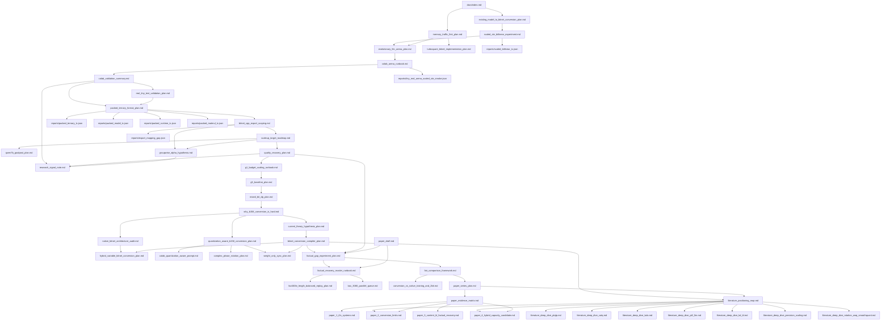

# BitNet-Transformers Research Index

이 문서는 현재 fork에서 진행 중인 BitNet 변환, memory-traffic 최적화,
scaled-STE, x86 I2_S runtime 검증 문서의 시작점이다.

## 프로젝트 목적 재정의

이 프로젝트의 목적은 "모델 파라미터 수를 줄인다"보다 좁고 실용적이다.

```text
흙수저용 LLM을 위해,
generated token 하나당 메모리에서 읽고 쓰는 bytes를 줄이는
기존 공개 모델 -> b1.58-friendly 후학습/변환 -> I2_S runtime 파이프라인을 만든다.
```

따라서 이제 핵심 질문은 세 가지다.

1. 낮은 후학습 비용으로 b1.58-friendly 모델을 만들 수 있는가?
2. 그 weight를 실제 ternary runtime에 충실히 옮길 수 있는가?
3. 실제 runtime에서 storage, latency, tokens/sec가 개선되는가?
4. 작고 빠른 runtime artifact가 실제 답변 품질도 회복할 수 있는가?
5. native BitNet / Q2_K / 우리 방식의 학습시간, 파라미터, 속도, 품질을 공정하게 비교했을 때 어디에 서는가?

## 한 줄 현재 결론

기존 모델을 teacher distillation 없이 BitNet-style ternary 영역으로 바로
내리는 것은 단순 PTQ만으로는 약하지만, S1 `alpha*T` scale을 보존하는
`ScaledBitLinear` + CE-only STE 후학습은 로컬 tiny arena, Colab seed sweep,
group-size sweep, activation fake-quant tiebreaker, 그리고 **real-text
(Wikitext, seed 31/32/33, act0·act8)** 모두에서 projected-QAT를 동률~우위로
이기는 첫 native BitLinear-style 후보다. packed ternary format은 Phase 4 reference까지
통과해 layer-level b1.58 저장(trit 1.600 bits/elem, 512x2048에서 fp16 대비
8.65x)과 모델 단위 export/import(logit error 0.0, whole-model 3.78x)를
검증했고, dense weight 파라미터 없는 `PackedTernaryLinear` runtime PoC도
logit error 0.0으로 통과했다. blocked dequant matmul reference는 dense weight
materialization 없이 8.0x 작은 transient working set으로 동일 출력을 냈지만,
Python loop라 latency는 아직 느리다.

**Export/runtime 판별 최신 결론(2026-06-25):** post-hoc groupwise->per-tensor
export는 lossy(PPL +55~77%)지만, **처음부터 per-tensor b1.58로 native STE
학습하면 groupwise와 ±1% PPL로 동급**이다. Python I2_S reference와 HF/F16/F32
GGUF export도 통과했다. bitnet.cpp I2_S는 **x86 Colab에서 공식 모델 f32
PPL 1.8547 vs i2_s PPL 1.8548로 정상**임이 확인됐고, RT-112에서 **우리 tiny
per-tensor-native b1.58 모델도 x86 I2_S에서 F16/F32 PPL parity**를 냈다.
반면 Mac M5/macOS26/clang21 로컬 빌드는 I2_S/TL1 ternary runtime이 깨진
상태다. 따라서 알고리즘/포맷은 유효하고, 현재 배포 검증 타겟은
**x86/Linux I2_S storage/latency**다.

## 지금 바로 할 일

RT-101~113까지의 runtime 조사는 완료됐다. 핵심 결론은:

- upstream I2_S quantizer는 latent fp weight에 대해 `sign(W) * absmax`라서
  우리 `mean(abs)` native quantization과 의미가 다르다.
- materialized ternary-dense `Wq = gamma*T`를 넣으면 저장 scale은 우리
  `gamma`로 보존된다(`Q_absmax(Q_mean(W))`의 scale half 실증).
- Mac M5 로컬 bitnet.cpp ternary runtime은 빌드/툴체인 문제로 신뢰 불가:
  I2_S는 공식 모델도 붕괴, TL1은 기본 `BITNET_ARM_TL1=OFF` 및 clang LUT
  compile blowup으로 막힘.
- x86 Colab에서는 같은 commit/모델/quantize 경로로 I2_S가 f32와 PPL parity를
  냈다.
- RT-112에서 우리 tiny per-tensor-native 모델도 ternary-dense Path A'
  (`Wq=gamma*T`)로 x86 I2_S F16/F32 parity를 냈다. latent FP를 바로 I2_S로
  보내는 Path A는 의도대로 붕괴했고, absmax-vs-absmean 문제가 확정됐다.

**RT-113 / EXPORT-006/007도 완료:** x86/Linux bitnet.cpp에서 RT-112 artifact의
storage와 latency를 측정했다. target-linear I2_S는 f32 대비 16x 작고,
token-generation은 f32 대비 약 1.97x 빠르다.

**RT-114 / SCALE-001도 완료(2026-06-25):** 실제 pretrained LLaMA(JackFram/llama-160m)
에서 84개 target linear를 `Wq=gamma*T`로 materialize(PTQ)해 검증했다. whole-file
압축률이 tiny의 0.45에서 **0.196**으로 target-linear(0.0625) 쪽으로 수렴했고,
token-gen 속도는 **f32 대비 5.69x, f16 대비 3.0x**로 tiny(~2x)보다 오히려 커졌다.
parity는 PPL상 1.043x로 보이지만 loss로는 +0.042 nats(0.3%)로, 잔차는 I2_S int8
activation 양자화(RT-106) 효과이지 encoding 결함이 아니다. 절대 PPL(~493k)은
ternary 학습 없는 PTQ라 망가진 게 당연하며 parity로만 판정했다. 즉 I2_S 이득은
toy 구조 산물이 아니라 실모델에서 더 커지며 runtime도 충실하다.

**RT-115 / SCALE-002도 완료(2026-06-25):** TinyLlama-1.1B(154 linears)로 scale law를
재확인했다. whole-file i2_s/f32가 tiny 0.450 → 160m 0.196 → **1.1B 0.1149**로 단조
수렴(target-linear 0.0625/16x는 세 모델 전부 동일, scale-invariant), token-gen
speedup은 **f32 대비 7.51x**로 더 커졌다(f32 2.43 → i2_s 18.26 t/s). parity는 i2_s
vs f16 = −0.0071 nats로 사실상 동일. 즉 storage/latency/parity는 1.1B 실모델에서
확인된 **scale law**다.

**RT-116/TRAIN-002/QR-004/QR-005도 완료:** teacher-free CE recovery는 Llama-160M에서
회복률 `0.905`, TinyLlama-1.1B 고정 budget에서 `0.480`을 보였고, 두 스케일 모두
adapted I2_S가 adapted F16을 `+0.002` nats 수준으로 보존했다. QR-005 ablation은
`target linears only`가 기본 recipe임을 확정했고, QR-004 prompt panel은 PTQ token
salad가 adapted fluent text로 회복됨을 사람 눈으로 확인했다.

**RT-117/118 gpt-oss 감사도 완료:** gpt-oss-20b는 이미 MXFP4 MoE라 ternary-MoE 투자
ROI가 거의 없으므로 현재 연구 메인은 dense LLaMA family로 고정한다.

**RT-120/121/122도 완료:** G1 budget scaling은 TinyLlama-1.1B 회복률을 `0.480`에서
`0.698`로 올려 budget artifact 가설을 지지했지만, RT-121 baseline은 OURS가 Q2_K를
PPL에서 이기지 못함을 보였고(RT-121, `114` vs `98`), RT-122 prompt panel은 1.1B
all-I2_S adapted greedy generation이 아직 usable하지 않음을 보였다.

**RT-123도 완료:** mixed-bit DP의 첫 단계인 single-group sensitivity scan은 18/24
그룹에서 FP-restore가 오히려 CE를 악화시켜 additive-DP 전제가 약함을 보였다. 따라서
DP는 후보 selector로 격하했다.

**RT-124~127 (quantization-aware track) 종결:** scale granularity(RT-124A, block +2.36
nats 부분 lever지만 runtime 필요)·scale/threshold objective(RT-124B, absmean이 이미
최적)·AWQ/SmoothQuant diagonal(RT-124C, +0.14)·GPTQ/Hessian assignment(RT-125, +0.51 =
gap의 6%)·signed-epsilon 2-bit codebook(RT-127, ternary 못 이김) — **어느 PTQ 기법도
one-shot 변환을 살리지 못한다. 병목은 quantizer가 아니라 adaptation/objective다**(짧은
adaptation이 모든 one-shot 트릭을 압도). plan의 Expected Conclusion #4 도달.

**RT-129 (decoding probe) — usability 회복:** RT-122의 1.1B greedy degeneration은
모델 손상이 아니라 **greedy artifact**였다. repetition penalty(1.2)/sampling이면
adapted i2_s가 ok `1/12 → 12/12`로 Q2_K/FP급 non-degenerate tier 회복, adapted
i2_s==f16. **표준 decoding에선 usable-tier 생성 가능**(단 사실 정확성 parity는 아님).

**현재 결론(2026-06-28 최신):** systems(faithful export + storage/speed scale law)
해결, CE/PPL recovery는 scales, generation usability는 sane decoding에서 회복,
quantizer는 lever 아님으로 판정. 남은 open gap은 **factual quality**(FP/Q2_K 미달)다.
FACT-003C의 `content-KL`은 첫 확실한 factual lever였고, lambda sweep은 inverted-U로
마감됐다: `lambda=0.2`가 fact `0.185`, CE recovery `0.845`, ok `27/27`로 best,
`0.1`은 너무 약해 salad, `0.5`는 과도 anchor로 facts를 씻어냈다. 이후 FACT-004A
lm_head unfreeze와 HYBRID-001A post-hoc FP restore는 모두 실패했고, FACT-003D small
hard replay는 1.1B에서 암기/과적합 함정을 보였다. 따라서 최신 모델은 **b1.58 변환을
단일 quantizer가 아니라 coordinate transform, saliency, capacity, representative
adaptation을 묶는 compiler 문제로 보는 것**이다. 공정 비교 축은
[Fair Comparison Framework](./fair_comparison_framework.md)에 고정한다.

packed format Phase 1/2/3/4 검증(로컬):

```bash
.venv/bin/python scripts/check_packed_ternary.py \
  --json-out reports/packed_ternary_tc.json --strict
.venv/bin/python scripts/check_packed_model.py \
  --json-out reports/packed_model_tc.json --strict
.venv/bin/python scripts/check_packed_runtime.py \
  --json-out reports/packed_runtime_tc.json --strict
.venv/bin/python scripts/check_packed_matmul.py \
  --json-out reports/packed_matmul_tc.json --strict
.venv/bin/python scripts/check_export_mapping.py \
  --json-out reports/export_mapping_gap.json --strict
.venv/bin/python scripts/check_i2s_export.py \
  --json-out reports/i2s_export_tc.json --strict
```

real-text fixture smoke(로컬, harness 확인용):

```bash
.venv/bin/python scripts/run_tiny_real_arena.py \
  --data-mode text \
  --text-path data/tiny_corpus.txt \
  --train-steps 40 \
  --qat-steps 12 \
  --ste-qat-steps 12 \
  --scaled-ste-steps 12 \
  --seq-len 64 \
  --batch-size 8 \
  --eval-batch-size 16 \
  --json-out reports/tiny_real_text_fixture_smoke.json
```

자세한 실행법:

- [Colab Arena Runbook](./colab_arena_runbook.md)
- [Colab Validation Summary](./colab_validation_summary.md)

x86/Linux runtime metrics 재현(수동 Colab/Linux shell, Colab MCP 불필요):

```bash
python scripts/rt113_storage_latency.py \
  --bitnet /content/bitnet.cpp \
  --model-dir /content/bitnet.cpp/models/tiny_pt_ternary \
  --json-out reports/rt113_storage_latency.json
```

로컬에서 사전 검정:

```bash
.venv/bin/python scripts/check_scaled_bitlinear.py --json-out reports/scaled_bitlinear_tc.json
.venv/bin/python scripts/run_tiny_real_arena.py --train-steps 200 --json-out reports/tiny_real_arena_scaled_ste_smoke.json --strict
```

## 읽는 순서

처음 읽는다면 이 순서를 추천한다.

1. [Memory-Traffic-First BitNet Plan](./memory_traffic_first_plan.md)
   - 왜 이 프로젝트가 "파라미터 수"보다 "토큰당 이동 byte"를 우선하는지 설명한다.
2. [Existing Model to BitNet Conversion Plan](./existing_model_to_bitnet_conversion_plan.md)
   - 기존 dense checkpoint를 teacher 없이 ternary domain으로 내리는 전체 ladder를 정의한다.
3. [Scaled-STE BitLinear Experiment](./scaled_ste_bitlinear_experiment.md)
   - 현재 가장 중요한 후보인 `ScaledBitLinear`의 수식, TC, 로컬 결과를 정리한다.
4. [Evolutionary LLM Arena Plan](./evolutionary_llm_arena_plan.md)
   - 후보들을 품질만이 아니라 memory/latency/RAM fitness로 비교하는 arena를 설명한다.
5. [Colab Arena Runbook](./colab_arena_runbook.md)
   - 로컬 smoke 이후 Colab에서 크기를 키우는 실행 절차다.
6. [Colab Validation Summary](./colab_validation_summary.md)
   - Colab moderate run과 seed sweep 통과 결과를 기록한다.
7. [Real Tiny Text Validation Plan](./real_tiny_text_validation_plan.md)
   - synthetic arena 이후 실제 토큰 분포 검증의 계획, 결과, 재현 경로다.
8. [Packed Ternary Weight Format Plan](./packed_ternary_format_plan.md)
   - real-text 통과 후 첫 storage 산출물. b1.58을 실제 byte로 바꾸는 format/TC다.
8b. [GGUF / bitnet.cpp Export Scoping Plan](./bitnet_cpp_export_scoping.md)
   - groupwise→I2_S 매핑 판정과 per-tensor-native export 결정.
8c. [I2_S Export PoC Plan](./i2s_export_poc_plan.md)
   - per-tensor-native → I2_S artifact → import logit 동일성(PTX-101~105)과 다음 runtime gate TC.
8d. [bitnet.cpp I2_S Layout Audit](./bitnet_cpp_i2s_layout_audit.md)
   - RT-101 upstream I2_S byte layout 감사 + RT-111 x86/Mac runtime 판정.
8e. [Scale-Up Target Roadmap](./scaleup_target_roadmap.md)
   - RT-114 Llama-160M을 먼저 닫고, 이후 gpt-oss-20b로 넘어가는 타겟 전략.
8e2. [Qwen 7B Goalpost Plan](./qwen7b_goalpost_plan.md)
   - 최종 제품 골대로 Qwen2.5-7B-Instruct를 고정하고, Qwen audit/smoke/full-run gate와 환경 예측을 정리한다.
8f. [Quality Recovery Plan](./quality_recovery_plan.md)
   - PTQ 붕괴, teacher-free adaptation, I2_S runtime 보존, 실제 답변 품질 평가 계획.
8g. [G1 Budget-Scaling Runbook](./g1_budget_scaling_runbook.md)
   - GPU 업그레이드 전 TinyLlama-1.1B 회복 budget-scaling을 한 번에 돌리기 위한 사전 점검/명령/판정 기준.
8h. [G5 Baseline Comparison Plan](./g5_baseline_plan.md)
   - 기존 one-shot quantization/QAT 대비 왜 이 방법이 필요한지 같은 eval/tool로 비교하는 baseline 계획.
8i. [Mixed-Bit DP Plan](./mixed_bit_dp_plan.md)
   - all-I2_S b1.58의 품질 한계를 선택적 Q2/Q3 업그레이드와 DP selector로 푸는 축. RT-123 이후에는 additive-DP solver가 아니라 후보 색인/보조축으로 둔다.
8j. [Why Existing Models Resist b1.58 Conversion](./why_b158_conversion_is_hard.md)
   - 왜 BitNet b1.58은 native 학습에선 좋지만 기존 모델 변환은 quantization처럼 쉽지 않은지 문제정의.
8j1. [Current Theory, Hypotheses, And Experiment Plan](./current_theory_hypothesis_plan.md)
   - 지금까지의 이론, 반증된 가설, 통합 수식, I2_S trunk와 보조 가지, Colab/PC 분업, TurboQuant-style projection 후보, 다음 실험 순서를 한 문서로 압축한 현재 관제탑.
8j2. [BitNet Conversion Compiler Plan](./bitnet_conversion_compiler_plan.md)
   - 지금까지의 실험과 QuaRot/AWQ/SmoothQuant/PTQTP/TWLA/HAWQ/HAQ/BRECQ 문헌을 합쳐, b1.58 변환을 valid coordinate transform(`G`), estimated saliency(`S=phi(...)`), budgeted capacity 선택(`C`), representative adaptation(`A`)의 staged compiler 문제로 정의한다.
8k. [Native BitNet Architecture Audit](./native_bitnet_architecture_audit.md)
   - 공개 BitNet 자료가 실제 구조(BitLinear, SubLN, relu2, native training, inference runtime)에 대해 말하는 것과 말하지 않는 것을 고정한다.
8l. [Hybrid / Variable BitNet Conversion Plan](./hybrid_variable_bitnet_conversion_plan.md)
   - content-KL이 plateau될 때 1:1 all-I2_S 대신 selective precision, multi-strip ternary, residual, late-layer capacity를 budgeted topology conversion으로 검증하는 계획.
8l2. [I2_S + LoRA / Residual Sidecar Plan](./i2s_lora_sidecar_plan.md)
   - I2_S base를 trunk로 유지한 채 전체를 Q2/Q3로 올리지 않고 `gamma*T + BA` 형태의 tiny low-rank sidecar로 behavior를 보정할 수 있는지 검증하는 SIDE-000..005 계획.
8l3. [Entropy-Guided I2_S Growth Plan](./entropy_guided_i2s_growth_plan.md)
   - STE 중 ternary code가 계속 뒤집히는 layer를 raw entropy만으로 판단하지 않고, temporal instability + output residual + task saliency로 bottleneck score를 만들고 top-k layer에만 I2_S-rooted auxiliary capacity를 붙이는 EGROW-001..005 계획.
8l4. [PC Negative Branch Map](./pc_negative_branch_map.md)
   - RTX 3080 / 160M cheap-screen에서 WSYNC, H-I2S, SIDE-001, EGROW-002가 무엇을 닫았고, EGROW-004/005 같은 조건부 단계가 왜 아직 비활성인지 정리한 실패지도.
8l5. [Nature-Inspired I2_S Smoke POC Plan](./nature_inspired_smoke_poc_plan.md)
   - 물리/신호처리/통계/생물/회계학에서 가져온 HOME, RDT, SIGMA, RHT, ECC 아이디어를 I2_S-rooted smoke POC로 우선순위화한다. 새 트랙은 반드시 PC smoke gate를 먼저 통과해야 한다.
8l6. [DINO-I2S Self-Distillation Plan](./dino_i2s_self_distillation_plan.md)
   - DINO/BYOL/Mean-Teacher식 no-label self-distillation을 I2_S adaptation objective로 번역한다. 작은 factual replay를 외우는 대신 FP/base teacher의 content distribution과 hidden geometry를 보존하는 후보 계획.
8m. [Quantization-Aware b1.58 Conversion Plan](./quantization_aware_b158_conversion_plan.md)
   - 기존 quantization toolbox(scale granularity, threshold/MSE objective, activation-aware scaling, GPTQ/Hessian assignment, rotation, signed-epsilon)를 BitNet 변환에 적용하는 처음부터 끝까지의 실험/가지치기 계획.
8n. [Colab Quantization-Aware Conversion Prompt](./colab_quantization_aware_prompt.md)
   - Colab을 실행할 수 있는 AI에게 그대로 줄 handoff prompt.
8o. [Complex / Phase Rotation Probe Plan](./complex_phase_rotation_plan.md)
   - `e^{iθ}` pairwise phase rotation이 b1.58 ternary 변환을 더 쉽게 만드는지 나중에 볼 수 있는 후속 분석/후보 아이디어.
8o2. [Weight-Only Sync Plan](./weight_only_sync_plan.md)
   - 대표 데이터 없이 weight geometry만으로 FP checkpoint와 b1.58 checkpoint를 먼저 맞추는 data-free 초기화 후보. Equalization, signed/permutation rotation, Hadamard diagnostic, RMSNorm/scale correction, residual upper bound를 WSYNC ladder로 정리한다.
8p. [Factual Gap Experiment Plan](./factual_gap_experiment_plan.md)
   - RT-129 이후 남은 open gap인 factual quality를 FACT-001 평가패널과 adaptation/objective 실험으로 검증하는 계획.
8q. [Factual Recovery Master Runbook](./factual_recovery_master_runbook.md)
   - RT-130 Outcome B 이후 factual recovery 분기를 한 번에 실행하는 single-flight runbook. 최신 상태: content-KL `lambda=0.2`가 current best, small hard replay는 1.1B에서 과적합 위험, 다음은 `mu=0.25` 판정과 PopQA blend 1.1B.
8q2. [FACT-003E Length-Balanced Replay Plan](./fact003e_length_balanced_replay_plan.md)
   - FACT-003D의 short atomic replay가 PTQ/QAT식 representative data가 아니라는 약점을 검증하기 위해, 같은 protected facts를 short/sentence/chat/explain/long surface로 확장하는 3080용 실험 계획.
8q3. [FACT-003H Result + Decision Table](./fact003h_result_and_decision.md)
   - PopQA blend 1.1B 결과 수신 템플릿(eval/popqa_tight/loose/train/CE/tags/i2s-f16)과 결과별 A~E 다음-실험 판정표. small hard replay 사망 후 왕좌 결정전.
8r. [Fair Comparison Framework](./fair_comparison_framework.md)
   - native BitNet, Q2_K, 우리 all-I2_S, 우리 hybrid를 처음부터 학습시간/후학습비용/파라미터/속도/품질로 공정 비교하는 scorecard.
8r2. [RTX 3080 Parallel Queue](./box_3080_parallel_queue.md)
   - Colab이 긴 1.1B run을 돌리는 동안 로컬 RTX 3080 박스를 fast predictor/evaluator로 쓰는 작업 큐와 SSH 명령.
8r3. [Conversion vs Native BitNet Training vs 2-bit Quantization](./conversion_vs_native_training_and_2bit.md)
   - b1.58 변환이 native BitNet 재학습이 되어버리는지, Q2_K/2-bit quantization과 무엇이 다른지 비교하는 핵심 리스크 문서.
8s. [Paper Series Plan](./paper_series_plan.md)
   - 지금까지의 결과를 여러 편의 논문/리포트로 나누는 publication roadmap. Paper 1 systems, Paper 2 conversion limits, Paper 3 content-KL, Paper 4 hybrid candidate.
8t. [Paper Evidence Matrix](./paper_evidence_matrix.md)
   - 논문별 known data, blank cells, claim 가능 범위를 한 표로 고정하는 중앙 증거표.
8u. [Literature Positioning Map](./literature_positioning_map.md)
   - BitNet/PTQ/rotation/precision-scaling 관련 논문들과 우리 결과의 위치, 더 앞선 방법, 빌릴 아이디어를 정리한 외부 문헌 지도.
8v. [Literature Deep Dive 01: PTQTP](./literature_deep_dive_ptqtp.md)
   - PTQTP의 dual trit-plane 방법, 우리와의 직접 경쟁 지점, 한계/검증 질문, HYBRID-001에 줄 인사이트.
8w. [Literature Deep Dive 02: CAT-Q](./literature_deep_dive_catq.md)
   - CAT-Q의 learnable modulation/softened ternarization, one-plane I2_S 유지 가능성, CAT-Q-lite 검증 아이디어.
8x. [Literature Deep Dive 03: TWLA](./literature_deep_dive_twla.md)
   - TWLA의 E2M asymmetric ternary, Kronecker rotation, inter-layer-aware activation mixed precision, TWLA-lite 검증 아이디어.
8y. [Literature Deep Dive 04: PT2-LLM](./literature_deep_dive_pt2_llm.md)
   - PT2-LLM의 asymmetric `mu + alpha*T`, activation-aware grid alignment, structural reordering, PT2-lite 검증 아이디어.
8z. [Literature Deep Dive 05: KD / KL Objectives](./literature_deep_dive_kd_kl.md)
   - MiniLLM/DistiLLM/AKL 안에서 content-KL의 위치, 안전한 claim, FACT-004 후보.
8aa. [Literature Deep Dive 06: Precision Scaling Laws](./literature_deep_dive_precision_scaling.md)
   - b1.58의 effective capacity 감소, undertrained quantization, mixed precision capacity budget, CAP-001..004 후보.
8aa2. [Literature Deep Dive 07: Rotation / AWQ / SmoothQuant Stack](./literature_deep_dive_rotation_awq_smoothquant.md)
   - QuaRot, SpinQuant, AWQ, SmoothQuant를 PTQTP/TWLA와 함께 묶어, output-preserving transform, salient-channel protection, capacity plane allocation을 우리 WSYNC/PopQA/hybrid 경로에 어떻게 붙일지 정리한다.
8ab. [Paper 1: I2_S Systems](./paper_1_i2s_systems.md)
   - faithful export, x86 I2_S parity, storage/speed scale law.
8ac. [Paper 2: Conversion Limits](./paper_2_conversion_limits.md)
   - 왜 기존 모델 b1.58 변환이 ordinary quantization이 아닌지, one-shot/quantizer failure 정리.
8ad. [Paper 3: Content-KL Factual Recovery](./paper_3_content_kl_factual_recovery.md)
   - FACT-001..003C, raw KL 실패와 content-KL 성공, lambda sweep 계획.
8ae. [Paper 4: Hybrid Capacity Candidate](./paper_4_hybrid_capacity_candidate.md)
   - content-KL plateau 이후 I2_S-rooted auxiliary capacity 가능성.
9. [Groupwise Alpha Hypothesis](./groupwise_alpha_hypothesis.md)
   - 왜 groupwise `alpha*T`가 per-tensor BitNet b1.58보다 품질을 더 잘 보존할 수 있는지 설명한다.
10. [Research Signal Note](./research_signal_note.md)
   - 왜 이 결과가 "연구자가 꿈꾸는 초반부"인지 해석한다.
11. [TurboQuant + BitNet Implementation Plan](./turboquant_bitnet_implementation_plan.md)
   - weight 변환이 안정화된 뒤 KV cache 압축으로 확장하는 별도 축이다.

## 문서 그래프



## 문서별 역할

| 문서 | 역할 | 언제 읽나 |
| --- | --- | --- |
| [memory_traffic_first_plan.md](./memory_traffic_first_plan.md) | 온디바이스/저자원 LLM에서 병목을 memory traffic으로 정의 | 방향성이 맞는지 판단할 때 |
| [existing_model_to_bitnet_conversion_plan.md](./existing_model_to_bitnet_conversion_plan.md) | 기존 모델 변환 ladder, 금지/허용 범위, TC matrix | 알고리즘 경계를 확인할 때 |
| [scaled_ste_bitlinear_experiment.md](./scaled_ste_bitlinear_experiment.md) | `ScaledBitLinear` 공식, TC, 로컬 결과 | 지금 구현한 핵심 후보를 볼 때 |
| [evolutionary_llm_arena_plan.md](./evolutionary_llm_arena_plan.md) | 후보 선택 fitness, Pareto, arena 결과 | 어떤 후보가 이겼는지 볼 때 |
| [colab_arena_runbook.md](./colab_arena_runbook.md) | Colab 실행 명령, sweep, 결과 해석 | 큰 run을 돌릴 때 |
| [colab_validation_summary.md](./colab_validation_summary.md) | Colab moderate run과 seed sweep milestone 기록 | Colab 결과가 다음 단계 조건을 충족했는지 확인할 때 |
| [real_tiny_text_validation_plan.md](./real_tiny_text_validation_plan.md) | synthetic task 이후 실제 토큰 분포 검증 계획과 통과 결과 | packed/export 전에 품질 위험을 줄일 때 |
| [packed_ternary_format_plan.md](./packed_ternary_format_plan.md) | packed ternary weight format, 2-bit/trit layout, storage TC | b1.58을 실제 byte로 저장/검증할 때 |
| [bitnet_cpp_export_scoping.md](./bitnet_cpp_export_scoping.md) | groupwise→I2_S 매핑 판정, per-tensor-native export 결정 | bitnet.cpp export 가능성을 판단할 때 |
| [i2s_export_poc_plan.md](./i2s_export_poc_plan.md) | I2_S Python export PoC(PTX-101~105), runtime gate TC | export 정확성/다음 C++ gate를 볼 때 |
| [bitnet_cpp_i2s_layout_audit.md](./bitnet_cpp_i2s_layout_audit.md) | RT-101 upstream I2_S byte layout 감사 + 매핑표 | GGUF writer 만들기 전 포맷 고정할 때 |
| [bitnet_cpp_export_scoping.md](./bitnet_cpp_export_scoping.md) | GGUF/bitnet.cpp export 가능성, format mapping, export TC 초안 | Python reference 이후 실제 runtime으로 넘어갈 때 |
| [scaleup_target_roadmap.md](./scaleup_target_roadmap.md) | Llama-160M -> gpt-oss-20b scale-up 순서와 gate | 어떤 공개 모델을 다음 목표로 삼을지 정할 때 |
| [qwen7b_goalpost_plan.md](./qwen7b_goalpost_plan.md) | Qwen2.5-7B-Instruct를 최종 제품 골대로 두고 Qwen 1.5B/3B/7B ladder, 성공 기준, 환경을 역산 | 코앞 실험이 최종 쓸만한 모델로 이어지는지 확인할 때 |
| [quality_recovery_plan.md](./quality_recovery_plan.md) | PTQ 붕괴 측정, CE-only recovery, I2_S 품질 보존, prompt 품질 평가 | 작고 빠른 모델이 실제로 쓸 만한지 판단할 때 |
| [g1_budget_scaling_runbook.md](./g1_budget_scaling_runbook.md) | RT-120 / TRAIN-003 사전 점검, A100/L4 one-shot 명령, 성공/실패 판정 | 1.1B 회복률 0.48을 GPU 업그레이드로 보강하기 직전 |
| [g5_baseline_plan.md](./g5_baseline_plan.md) | B0/B1/Q2_K/Q3_K/Q4_0/OURS baseline panel 설계 | "왜 기존 quantization이 아니라 이 방법인가"를 답할 때 |
| [mixed_bit_dp_plan.md](./mixed_bit_dp_plan.md) | RT-123 sensitivity scan과 mixed-bit selector 초안. RT-123 이후 full additive DP는 보류 | higher-bit pockets를 후보 색인용으로만 참고할 때 |
| [why_b158_conversion_is_hard.md](./why_b158_conversion_is_hard.md) | 기존 FP 모델을 b1.58로 변환하기 어려운 이유를 수학/통계/시스템 결과로 정리 | 프로젝트 질문을 다시 정의하고 claim을 좁힐 때 |
| [current_theory_hypothesis_plan.md](./current_theory_hypothesis_plan.md) | 지금까지의 이론, 가설 판정, 통합 수식, I2_S trunk와 보조 가지, Colab/PC 분업, TurboQuant-style projection 후보, 다음 실험 순서를 압축한 관제탑 | 현재 어디까지 왔고 다음 무엇을 해야 하는지 빠르게 정렬할 때 |
| [bitnet_conversion_compiler_plan.md](./bitnet_conversion_compiler_plan.md) | b1.58 변환을 valid coordinate transform, saliency estimator, adaptive capacity, representative adaptation의 staged compiler 문제로 정의하는 상위 수식/가정/실행 계획 | WSYNC/PopQA/PTQTP-lite/hybrid 중 무엇을 먼저 실험할지 정할 때 |
| [native_bitnet_architecture_audit.md](./native_bitnet_architecture_audit.md) | 공개 BitNet 자료의 실제 구조와 비공개/미확정 부분을 정리 | native BitNet이 그냥 LLaMA+ternary인지 판단할 때 |
| [hybrid_variable_bitnet_conversion_plan.md](./hybrid_variable_bitnet_conversion_plan.md) | 1:1 all-I2_S 대신 가변 capacity/하이브리드 topology를 검증하는 HYBRID-001 계획 | factual gap을 capacity/topology 문제로 검증할 때 |
| [i2s_lora_sidecar_plan.md](./i2s_lora_sidecar_plan.md) | I2_S base를 trunk로 유지하고 tiny low-rank residual sidecar를 붙여, 부족한 factual/behavior capacity를 보정할 수 있는지 검증하는 SIDE-000..005 계획 | Q2/Q3 전체 업그레이드 전에 I2_S-rooted 보정이 가능한지 볼 때 |
| [entropy_guided_i2s_growth_plan.md](./entropy_guided_i2s_growth_plan.md) | temporal ternary entropy, flip-rate, gradient conflict, output residual, task saliency를 묶어 어디에만 I2_S-rooted auxiliary capacity를 붙일지 정하는 EGROW 계획 | sidecar/extra-plane을 전체에 붙이지 않고 layer별 bottleneck을 찾아 진화시키고 싶을 때 |
| [pc_negative_branch_map.md](./pc_negative_branch_map.md) | 160M PC cheap screens에서 닫힌 geometry/capacity 가지와 재개 조건을 정리한 실패지도 | 새 실험을 열기 전에 이미 죽은 가지인지 확인할 때 |
| [nature_inspired_smoke_poc_plan.md](./nature_inspired_smoke_poc_plan.md) | homeostasis, rate-distortion ledger, sigma-delta residual feedback, dithered RHT, ECC syndrome sidecar를 유망도 순서로 smoke POC화한 계획 | 외부 분야 아이디어를 새 트랙으로 키우기 전에 PC에서 싼 gate를 설계할 때 |
| [dino_i2s_self_distillation_plan.md](./dino_i2s_self_distillation_plan.md) | DINO/BYOL/Mean-Teacher식 비지도/자가증류를 I2_S factual-retention objective로 번역한 계획. content-KL을 broad no-label teacher-student consistency로 확장한다 | 작은 replay가 암기/과적합할 때, 정답 label 없이 FP/base 모델의 지식장을 덜 잊게 만드는 objective를 검증할 때 |
| [quantization_aware_b158_conversion_plan.md](./quantization_aware_b158_conversion_plan.md) | quantization 기법을 b1.58 변환에 적용하는 RT-124..128 전체 실험계획, 가지치기, 결론 도달 규칙 | 다음 Colab 실험을 설계하거나 결과를 해석할 때 |
| [colab_quantization_aware_prompt.md](./colab_quantization_aware_prompt.md) | Colab 실행 가능한 AI에게 줄 copy-paste prompt와 결과 템플릿 | 다른 실행자에게 RT-124를 넘길 때 |
| [complex_phase_rotation_plan.md](./complex_phase_rotation_plan.md) | 복소수 위상 `e^{iθ}`를 pairwise real rotation으로 구현하는 후속 분석/후보 아이디어 | factual gap 이후 rotation 후보를 다시 볼지 판단할 때 |
| [weight_only_sync_plan.md](./weight_only_sync_plan.md) | 대표 데이터 없이 weight-only equalization/rotation/scale-correction으로 FP와 b1.58을 먼저 맞추는 WSYNC 실험 사다리 | 작은/비대표 후학습 데이터가 암기 함정에 빠질 때, adaptation 전 초기화 후보를 검증할 때 |
| [factual_gap_experiment_plan.md](./factual_gap_experiment_plan.md) | FACT-001 current factual gap panel과 FACT-002..003 adaptation/objective 개선 실험 설계 | RT-129 이후 factual quality gap을 다룰 때 |
| [factual_recovery_master_runbook.md](./factual_recovery_master_runbook.md) | RT-130 결과 이후 FACT-002 instruction/mixed adaptation, FACT-003 분기, 구현 패킷, 문서화 체크포인트, Colab handoff prompt를 한 번에 묶은 실행 문서 | 다음 factual recovery run을 다른 실행자/Colab에 넘길 때 |
| [fact003e_length_balanced_replay_plan.md](./fact003e_length_balanced_replay_plan.md) | short atomic replay가 대표 calibration/adaptation data가 아니라는 약점을 검증하는 length-mixed protected replay 계획과 3080 명령 | FACT-003D가 데이터 대표성 문제였는지 싸게 분리할 때 |
| [fair_comparison_framework.md](./fair_comparison_framework.md) | native BitNet / Q2_K / ours all-I2_S / ours hybrid를 학습비용, 파라미터, storage, speed, 품질로 비교하는 표준 scorecard | 큰 LLaMA 적용이나 논문 비교를 공정하게 정리할 때 |
| [box_3080_parallel_queue.md](./box_3080_parallel_queue.md) | Colab 본 학습 중 RTX 3080 box가 맡을 seed/eval/smoke 작업 큐와 SSH 명령 | 로컬 PC를 놀리지 않고 다음 분기 준비를 할 때 |
| [conversion_vs_native_training_and_2bit.md](./conversion_vs_native_training_and_2bit.md) | b1.58 변환이 native BitNet 재학습과 어떻게 다르고, Q2_K/2-bit quantization과 어떻게 공정 비교해야 하는지 정리 | adaptation cost가 너무 커지는지 판단하거나 목표 tier를 정할 때 |
| [paper_series_plan.md](./paper_series_plan.md) | 여러 편의 논문/리포트로 결과를 나누는 전체 지도 | 무엇을 어느 논문에 넣을지 헷갈릴 때 |
| [paper_evidence_matrix.md](./paper_evidence_matrix.md) | 논문별 known result, blank cell, claim guardrail을 모은 중앙 증거표 | 논문 초안에 어떤 숫자를 넣고 어떤 칸을 비워둘지 정할 때 |
| [literature_positioning_map.md](./literature_positioning_map.md) | BitNet, PTQ ternarization, rotation, precision scaling, factual forgetting 문헌과 우리 결과의 위치를 비교 | 우리가 가는 방향이 이미 있는지, 더 앞선 방법에서 무엇을 빌릴지 볼 때 |
| [literature_deep_dive_ptqtp.md](./literature_deep_dive_ptqtp.md) | PTQTP의 dual trit-plane 방법, 우리 실험과의 겹침, 한계/검증 질문, 다음 reproduction 계획 | multi-strip/adaptive plane 방향을 잡을 때 |
| [literature_deep_dive_catq.md](./literature_deep_dive_catq.md) | CAT-Q의 learnable modulation, softened ternarization, sliding-layer optimization과 우리 one-plane I2_S 경로의 연결 가능성 | multi-plane으로 가기 전 stronger one-plane PTQ를 검증할 때 |
| [literature_deep_dive_twla.md](./literature_deep_dive_twla.md) | TWLA의 E2M asymmetric ternary, Kronecker rotation, activation mixed precision, inter-layer allocation을 우리 실험과 연결 | rotation/activation-bit/interaction-aware selector를 진지한 후보로 볼 때 |
| [literature_deep_dive_pt2_llm.md](./literature_deep_dive_pt2_llm.md) | PT2-LLM의 asymmetric ternary grid, ITF, activation-aware grid alignment, structural reordering을 I2_S projection 질문으로 정리 | `mu + alpha*T` 힌트를 pure I2_S 또는 hybrid로 나눠 검증할 때 |
| [literature_deep_dive_kd_kl.md](./literature_deep_dive_kd_kl.md) | MiniLLM, DistiLLM, AKL 속에서 content-KL을 vocabulary-support intervention으로 위치시킨다 | FACT-004 factual objective를 설계할 때 |
| [literature_deep_dive_precision_scaling.md](./literature_deep_dive_precision_scaling.md) | precision scaling law, undertrained quantization, mixed quantization을 effective-capacity 관점으로 정리 | pure b1.58이 부족할 때 strips/planes/hybrid capacity를 정당화할 때 |
| [literature_deep_dive_rotation_awq_smoothquant.md](./literature_deep_dive_rotation_awq_smoothquant.md) | QuaRot/SpinQuant/AWQ/SmoothQuant와 PTQTP/TWLA를 하나의 conversion stack으로 해석해 WSYNC, PopQA blend, adaptive trit-plane 경로를 정렬 | rotation/equalization/activation-aware scaling 중 무엇을 먼저 빌릴지 정할 때 |
| [paper_1_i2s_systems.md](./paper_1_i2s_systems.md) | I2_S export/runtime/storage/speed scale law skeleton | systems 논문을 작성할 때 |
| [paper_2_conversion_limits.md](./paper_2_conversion_limits.md) | one-shot b1.58 변환 실패와 quantizer 한계 skeleton | negative/conversion-limit 논문을 작성할 때 |
| [paper_3_content_kl_factual_recovery.md](./paper_3_content_kl_factual_recovery.md) | FACT objective/content-KL factual recovery skeleton | λ sweep과 factual recovery 논문을 작성할 때 |
| [paper_4_hybrid_capacity_candidate.md](./paper_4_hybrid_capacity_candidate.md) | HYBRID-001 이후 후보 논문 skeleton | I2_S-rooted auxiliary capacity 결과가 나온 뒤 |
| [groupwise_alpha_hypothesis.md](./groupwise_alpha_hypothesis.md) | groupwise scale이 품질을 보존하는 이유와 검증할 ablation | 알고리즘 우위의 원인을 설명하거나 반증할 때 |
| [research_signal_note.md](./research_signal_note.md) | 현재 결과가 연구 신호로서 왜 의미 있는지 해석 | 논문화 가능성과 다음 방향을 판단할 때 |
| [turboquant_bitnet_implementation_plan.md](./turboquant_bitnet_implementation_plan.md) | KV cache 압축 계획과 TC | weight 변환 이후 긴 문맥으로 확장할 때 |

## 코드와 문서 연결

| 코드/스크립트 | 관련 문서 | 역할 |
| --- | --- | --- |
| [bitnet_llama/module.py](../bitnet_llama/module.py) | [Scaled-STE BitLinear Experiment](./scaled_ste_bitlinear_experiment.md) | `BitLinear`, `ScaledBitLinear` 레이어 구현 |
| [bitnet_llama/conversion.py](../bitnet_llama/conversion.py) | [Existing Model to BitNet Conversion Plan](./existing_model_to_bitnet_conversion_plan.md) | S0/S1 ternary conversion reference |
| [scripts/check_scaled_bitlinear.py](../scripts/check_scaled_bitlinear.py) | [Scaled-STE BitLinear Experiment](./scaled_ste_bitlinear_experiment.md) | SSTE 수식/gradient TC |
| [scripts/run_tiny_real_arena.py](../scripts/run_tiny_real_arena.py) | [Evolutionary LLM Arena Plan](./evolutionary_llm_arena_plan.md) | 후보별 tiny real-model arena |
| [scripts/run_colab_scaled_ste_arena.sh](../scripts/run_colab_scaled_ste_arena.sh) | [Colab Arena Runbook](./colab_arena_runbook.md) | Colab용 실행 wrapper |
| [scripts/estimate_memory_traffic.py](../scripts/estimate_memory_traffic.py) | [Memory-Traffic-First BitNet Plan](./memory_traffic_first_plan.md) | bytes/token 추정 |
| [bitnet_llama/packing.py](../bitnet_llama/packing.py) | [Packed Ternary Weight Format Plan](./packed_ternary_format_plan.md) | two_bit/trit pack·unpack, groupwise alpha, model export/import, storage |
| [scripts/check_packed_ternary.py](../scripts/check_packed_ternary.py) | [Packed Ternary Weight Format Plan](./packed_ternary_format_plan.md) | PACK-001..006 storage TC |
| [bitnet_llama/i2s_export.py](../bitnet_llama/i2s_export.py) | [I2_S Export PoC Plan](./i2s_export_poc_plan.md) | per-tensor b1.58 I2_S export/import reference |
| [scripts/check_i2s_export.py](../scripts/check_i2s_export.py) | [I2_S Export PoC Plan](./i2s_export_poc_plan.md) | PTX-101..105 export 정확성 TC |
| [scripts/rt112_x86_arena.py](../scripts/rt112_x86_arena.py) | [GGUF / bitnet.cpp Export Scoping Plan](./bitnet_cpp_export_scoping.md) | x86 I2_S artifact parity: latent Path A vs ternary-dense Path A' |
| [scripts/rt113_storage_latency.py](../scripts/rt113_storage_latency.py) | [GGUF / bitnet.cpp Export Scoping Plan](./bitnet_cpp_export_scoping.md) | EXPORT-006/007 target-linear storage and llama-bench latency metrics |
| [scripts/rt114_scaleup.py](../scripts/rt114_scaleup.py) | [Scale-Up Target Roadmap](./scaleup_target_roadmap.md) | Llama-160M SCALE-001 export/runtime scale-up driver |
| [scripts/rt121_baseline_panel.py](../scripts/rt121_baseline_panel.py) | [G5 Baseline Comparison Plan](./g5_baseline_plan.md) | B0/B1/Q2_K/Q3_K/Q4_0/OURS same-tool baseline panel |
| [scripts/check_packed_model.py](../scripts/check_packed_model.py) | [Packed Ternary Weight Format Plan](./packed_ternary_format_plan.md) | PACK-101..103 model export/import TC |
| [scripts/check_packed_runtime.py](../scripts/check_packed_runtime.py) | [Packed Ternary Weight Format Plan](./packed_ternary_format_plan.md) | PACK-201..204 packed runtime module TC |
| [scripts/check_packed_matmul.py](../scripts/check_packed_matmul.py) | [Packed Ternary Weight Format Plan](./packed_ternary_format_plan.md) | PACK-301..304 blocked dequant matmul reference TC |
| [scripts/check_export_mapping.py](../scripts/check_export_mapping.py) | [GGUF / bitnet.cpp Export Scoping Plan](./bitnet_cpp_export_scoping.md) | EXPORT-002 groupwise vs per-tensor b1.58 mapping gap |

## 리포트 연결

| Report | 생성 명령 | 읽는 법 |
| --- | --- | --- |
| [scaled_bitlinear_tc.json](../reports/scaled_bitlinear_tc.json) | `scripts/check_scaled_bitlinear.py` | S1 `alpha*T` equivalence와 STE gradient가 통과했는지 확인 |
| [tiny_real_arena_scaled_ste_smoke.json](../reports/tiny_real_arena_scaled_ste_smoke.json) | `scripts/run_tiny_real_arena.py --train-steps 200 --strict` | scaled-STE가 projected-QAT와 fp16 dense 대비 어떤 위치인지 확인 |
| [tiny_real_arena_ste_qat_smoke.json](../reports/tiny_real_arena_ste_qat_smoke.json) | 이전 BitLinear STE smoke | scale 없는 STE가 왜 약한지 비교 |
| [tiny_real_arena_qat_smoke.json](../reports/tiny_real_arena_qat_smoke.json) | projected-QAT smoke | scaled-STE의 비교 기준 |
| [memory_traffic_bitllama_512x4.json](../reports/memory_traffic_bitllama_512x4.json) | `scripts/estimate_memory_traffic.py` | weight/KV policy별 bytes/token 추정 |
| [packed_ternary_tc.json](../reports/packed_ternary_tc.json) | `scripts/check_packed_ternary.py` | trit/two_bit pack round-trip, dense 일치, storage 압축률 확인 |
| [i2s_export_tc.json](../reports/i2s_export_tc.json) | `scripts/check_i2s_export.py` | I2_S export/import logit·PPL 동일성, storage 8x 확인 |
| [packed_model_tc.json](../reports/packed_model_tc.json) | `scripts/check_packed_model.py` | 모델 단위 pack/unpack logit 동일성, save/load, whole-model storage 확인 |
| [packed_runtime_tc.json](../reports/packed_runtime_tc.json) | `scripts/check_packed_runtime.py` | `PackedTernaryLinear` forward/logit/state round-trip, no dense weight 확인 |
| [packed_matmul_tc.json](../reports/packed_matmul_tc.json) | `scripts/check_packed_matmul.py` | dense materialize 없는 blocked dequant matmul 정확성, working-set, latency honesty 확인 |
| [export_mapping_gap.json](../reports/export_mapping_gap.json) | `scripts/check_export_mapping.py` | bitnet.cpp-style per-tensor b1.58 export가 groupwise S1보다 얼마나 lossy한지 확인 |

## 현재 실험 상태

완료:

- BitLinear ternarization 버그와 용어 혼동 정리
- S0/S1 conversion reference 구현
- tiny real-model arena 구현
- projected-QAT 후보 구현
- scale 없는 `BitLinear` STE 후보 구현 및 한계 확인
- S1 scale을 보존하는 `ScaledBitLinear` 구현
- scaled-STE TC 및 local strict smoke 통과
- Colab runner와 runbook 작성
- Colab faster smoke, moderate arena, seed sweep `31/32/33` 통과
- scaled-STE quality winner `3/3`, Pareto frontier 조건 충족
- group-size sweep `32/64/128` 통과
- group-size별 scaled-STE quality winner `3/3`, frontier `3/3`, loss band `0.2875-0.2996`
- activation fake-quant seed `31`은 collapse 없이 borderline frontier 이탈
- act8 seed `31`: acc `0.906`, loss `0.286`, KL `0.083`, projected-QAT에 RAM/accuracy tie-break로 dominate
- act8 tiebreaker seed `32/33` 통과
- seed `32/33`에서 scaled-STE act8은 quality winner, resource winner, frontier 유지
- watch item: scaled-STE의 KL-to-fp16이 projected-QAT보다 약간 높음
- text mode implemented in `scripts/run_tiny_real_arena.py`
- local byte-level fixture smoke passes, but is harness-only
- Colab real-text 검증 통과: Wikitext-2 200KB, seed `31/32/33`, act0·act8 모두 scaled-STE가 acc/loss/PPL/fitness에서 projected-QAT 상회, frontier `3/3`, generation smoke 정상
- packed ternary format Phase 1 구현·통과: `bitnet_llama/packing.py`, `scripts/check_packed_ternary.py`, trit 1.600 bits/elem, fp16 대비 8.65x, to_dense가 conversion.S1과 정확히 일치
- packed ternary format Phase 2 구현·통과: `pack_model`, `unpack_into_model`, `save_packed_model`, `load_packed_model`, `model_storage_report`
- model-wide export/import TC 통과: logit error `0.00e+00`, artifact save/load error `0.00e+00`, 14 layers packed, whole-model `3.78x` vs fp16
- packed ternary format Phase 3 구현·통과: `PackedTernaryLinear`, `replace_target_linears_with_packed`
- runtime module TC 통과: layer/model/state logit error `0.00e+00`, 14 packed modules, dense float weight parameter 없음, target linear storage `8.65x` vs fp16
- Phase 3 한계 확인: forward에서 dense `alpha*T` weight를 일시 materialize하므로 compute-time memory/latency 이득은 Phase 4 대상
- packed ternary format Phase 4 reference 구현·통과: `unpack_range`, `packed_linear_matmul`, `PackedTernaryLinear(fused=True)`
- blocked dequant matmul TC 통과: correctness/logit error `0.00e+00`, transient working set `8.0x` 감소
- latency honesty: Python-loop blocked path는 dense보다 느림(현재 리포트 기준 `1.2x`). 실제 speed gain은 kernel/export runtime 필요
- GGUF/bitnet.cpp export Step 0/1 완료: bit layout은 호환 가능성이 있으나 scale granularity가 불일치
- direct I2_S-style mapping 판정: groupwise `alpha`를 per-tensor scale로 무너뜨려야 하므로 lossy
- export mapping gap 측정: per-tensor b1.58 output error가 groupwise S1보다 `+18.4%` 나쁨, 14/14 target linears
- export-gate arena 후보 추가: `s1_scaled_ste_export_pt_int8_kv`, `s1_scaled_ste_export_pt_int4_kv`
- local fixture smoke 신호: groupwise `loss 2.400/acc 0.311`, per-tensor export `loss 2.472/acc 0.274`; 참고용이며 판정은 Colab Wikitext에서 수행
- `per_tensor_ste_native` 후보 추가(`PerTensorBitLinear`, b1.58 absmean, 단일 γ, STE) — I2_S와 동일 scale granularity
- **Per-tensor native 판별 게이트 통과(Colab Wikitext seed 31/32/33)**: native per-tensor PPL이 groupwise 대비 `-0.9% / +1.0% / 0.0%`(±1% 이내), frontier `2/3`(seed 33은 quality+resource winner), KL `0.149~0.175`(정상), generation 정상
- **결정**: post-hoc export(PPL +55~77%)는 lossy지만 native per-tensor는 동급 → per-tensor-native가 올바른 export source이며, groupwise는 품질의 본질 아님(가설 B 입증).
- **I2_S export Python PoC 통과(commit 5df98bf)**: `bitnet_llama/i2s_export.py`(gamma+2-bit codes), `scripts/check_i2s_export.py` PTX-101~105 — native→artifact→import logit/PPL 동일(err 3.6e-7), target 8x vs fp16. Python reference는 정확성 증명이며 runtime speed는 아직 아님
- **RT-101~103 통과**: bitnet.cpp I2_S layout 감사, official/tiny F32 GGUF 변환, I2_S quantize/load smoke 완료. plain LLaMA arch도 converter/runtime loader가 받음.
- **RT-104~106 판정**: latent FP를 upstream I2_S로 바로 quantize하면 semantics가 달라져 붕괴한다(`absmax/sign` vs 우리 `mean(abs)/round`). ternary-dense `Wq=gamma*T`를 넣으면 scale은 `gamma`로 보존되지만, Mac I2_S runtime에서는 PPL이 깨짐.
- **RT-107~109 판정**: Mac M5/macOS26/clang21 로컬 ternary runtime은 신뢰 불가. official I2_S도 붕괴, TL1은 `BITNET_ARM_TL1=OFF` 기본 빌드와 clang LUT compile blowup으로 막힘.
- **RT-111 판정**: x86 Colab에서 official `bitnet_b1_58-large` f32 PPL `1.8547`, i2_s PPL `1.8548`로 parity. I2_S upstream/runtime은 정상이며 Mac 한정 빌드/툴체인 문제로 결론.
- **RT-112 판정**: 우리 tiny per-tensor-native b1.58 모델도 x86 I2_S에서 통과. ternary-dense Path A'는 `i2_s 305.02 ~= f16 306.48 ~= f32 306.42`, latent Path A는 `i2_s 2071 vs f16 806`으로 붕괴. Path B byte-writer 불필요.
- **RT-113 / EXPORT-006/007 판정**: x86에서 storage+latency 측정. target-linear i2_s는 f32 대비 **16x 압축**(0.0626), 전체 파일은 f16 임베딩 floor에 희석되어 0.45. llama-bench(t=2, 4~5 run)에서 i2_s가 양쪽 다 最速이며 i2_s 절대값이 안정적(pp ~11200, tg ~595 t/s) — 강건한 비율로 **prompt ~1.7x vs f32, token-gen ~2x vs f32/f16**(공유 CPU 노이즈로 f32/f16 tg가 흔들려 비율 1.8~3.5x 범위). peak RSS는 mmap이라 무차별(파일 bytes+tg t/s가 메모리 지표). per-tensor-native→I2_S는 정확할 뿐 아니라 x86에서 효율적이며 custom kernel 불필요.

다음:

1. **FACT-003D `mu=0.25` 1.1B 결과 확인:** content-KL baseline `0.185`를 넘지 못하면
   small hard replay는 보조 진단으로 강등한다.
2. **FACT-003H PopQA blend 1.1B:** tiny hard facts가 아니라 representative factual stream이
   train/heldout/FACT를 함께 움직이는지 본다. 현재 가장 중요한 다음 run이다.
3. **WSYNC-001/002 160M:** data-free/weight-only equalization, row-scale, signed permutation,
   Hadamard diagnostic을 좁게 돌려 coordinate transform이 출발점을 개선하는지 확인한다.
4. **Turbo projection probe:** KV cache에는 RHT/sphere/codebook reference, weight에는
   `Q(W H^T) Hx` H-I2S linear probe를 돌린다. PyTorch reference에서 이득이 없으면 kernel
   작업으로 넘어가지 않는다.
5. **Saliency + I2_S-rooted auxiliary capacity:** PopQA/instruction activation으로 `S=phi(...)`를 추정한 뒤
   top-k protection, two-plane/PTQTP-lite, Q2/Q3 pockets를 random-k와 비교한다.
6. **EGROW-002 sensitivity-guided sidecar:** EGROW-001은 top-8 overlap 7/8로 locator 안정성을
   보였지만 flip/entropy가 아니라 residual x task saliency가 판별자였다. 다음은
   down_proj-heavy top-k sidecar가 random-k/last-k를 이기는지 확인한다.
7. **Scale ladder:** 1.1B에서 실제 component gain이 확인된 뒤 Gemma/Qwen small audit,
   마지막으로 Qwen 7B-class goalpost로 넘어간다.
8. Mac M5 I2_S/TL1은 보류한다. 필요하면 upstream bug report용 최소 재현으로 분리한다.

이전 보류 항목 중 packed reference ladder는 완료됐고, export 경로도 판별됐다
(per-tensor-native → I2_S 직행). 남은 다음 축:

- factual gap: RT-130으로 measured gap 확정, FACT-002 data swap 실패, FACT-003A answer-mask 부분 성공, FACT-003B raw-KL 실패, FACT-003C content-KL `lambda=0.2` WIN, FACT-004A lm_head unfreeze 폐기, HYBRID-001A post-hoc FP restore 폐기, FACT-003D small hard replay는 1.1B에서 과적합 위험 확인. 현재는 `mu=0.25` 결과와 PopQA blend 1.1B가 다음 분기
- quantization-aware b1.58 conversion: RT-124~127로 종결. quantizer는 병목이 아님
- complex/phase rotation probe: 메인 트랙이 아니라 후속 분석/후보 아이디어. arbitrary rotation이 아니라 sign/swap·Hadamard-like cheap phase만 나중에 좁게 검증
- mixed-bit DP: all-I2_S의 품질/생성 한계를 selective Q2/Q3 업그레이드로 보완하는 보조축. RT-123 결과상 full additive DP는 보류
- variance: 논문용 설득력을 위해 seed 반복 추가
- groupwise GGUF 확장 / custom kernel: export 트랙이면 불필요. groupwise의 약간 더 나은
  reconstruction을 살리려는 연구용으로만 선택적
- TurboQuant-style projection: KV cache RHT/sphere/codebook과 weight H-I2S projection을 PyTorch reference로 먼저 검증. 이득이 있을 때만 kernel 구현

단, raw Colab JSON이 현재 local workspace에 없으므로 논문식 정량 주장 전에는
보고서를 회수하거나 sweep을 재실행한다.
