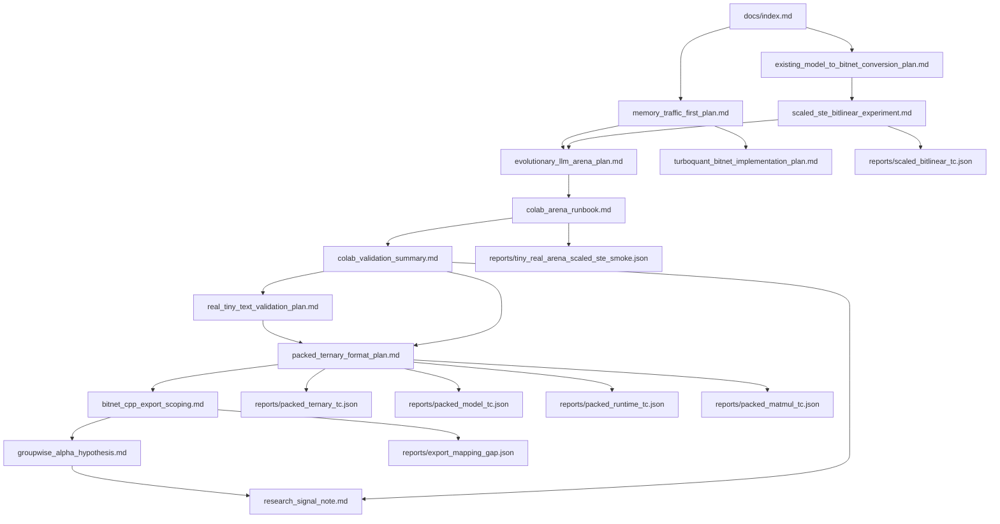

# BitNet-Transformers Research Index

이 문서는 현재 fork에서 진행 중인 BitNet 변환, memory-traffic 최적화,
scaled-STE, Colab 실험 준비 문서의 시작점이다.

## 한 줄 현재 결론

기존 모델을 teacher distillation 없이 BitNet-style ternary 영역으로 바로
내리는 것은 단순 PTQ만으로는 약하지만, S1 `alpha*T` scale을 보존하는
`ScaledBitLinear` + CE-only STE 후학습은 로컬 tiny arena, Colab seed sweep,
group-size sweep, activation fake-quant tiebreaker, 그리고 **real-text
(Wikitext, seed 31/32/33, act0·act8)** 모두에서 projected-QAT를 동률~우위로
이기는 첫 native BitLinear-style 후보다. packed ternary format은 Phase 4 reference까지
통과해 layer-level b1.58 저장(trit 1.600 bits/elem, 512x2048에서 fp16 대비
8.65x)과 모델 단위 export/import(logit error 0.0, whole-model 3.78x)를
검증했고, dense weight 파라미터 없는 `PackedTernaryLinear` runtime PoC도
logit error 0.0으로 통과했다. blocked dequant matmul reference는 dense weight
materialization 없이 8.0x 작은 transient working set으로 동일 출력을 냈지만,
Python loop라 latency는 아직 느리다.

## 지금 바로 할 일

real-text 검증과 packed ternary reference ladder(Phase 1-4)가 끝났고,
GGUF/bitnet.cpp export Step 0/1도 완료됐다. 결론은 직접 I2_S-style export가
`alpha*T` groupwise scale을 per-tensor scale로 무너뜨리는 **lossy re-quantization**
이라는 것이다. `per_tensor_b158` export-gate 후보는 arena에 추가됐고, 다음은
Colab Wikitext seed sweep으로 PPL 손실이 감당 가능한지 확인하는 quality gate다.

packed format Phase 1/2/3/4 검증(로컬):

```bash
.venv/bin/python scripts/check_packed_ternary.py \
  --json-out reports/packed_ternary_tc.json --strict
.venv/bin/python scripts/check_packed_model.py \
  --json-out reports/packed_model_tc.json --strict
.venv/bin/python scripts/check_packed_runtime.py \
  --json-out reports/packed_runtime_tc.json --strict
.venv/bin/python scripts/check_packed_matmul.py \
  --json-out reports/packed_matmul_tc.json --strict
.venv/bin/python scripts/check_export_mapping.py \
  --json-out reports/export_mapping_gap.json --strict
```

real-text fixture smoke(로컬, harness 확인용):

```bash
.venv/bin/python scripts/run_tiny_real_arena.py \
  --data-mode text \
  --text-path data/tiny_corpus.txt \
  --train-steps 40 \
  --qat-steps 12 \
  --ste-qat-steps 12 \
  --scaled-ste-steps 12 \
  --seq-len 64 \
  --batch-size 8 \
  --eval-batch-size 16 \
  --json-out reports/tiny_real_text_fixture_smoke.json
```

자세한 실행법:

- [Colab Arena Runbook](./colab_arena_runbook.md)
- [Colab Validation Summary](./colab_validation_summary.md)

로컬에서 사전 검정:

```bash
.venv/bin/python scripts/check_scaled_bitlinear.py --json-out reports/scaled_bitlinear_tc.json
.venv/bin/python scripts/run_tiny_real_arena.py --train-steps 200 --json-out reports/tiny_real_arena_scaled_ste_smoke.json --strict
```

## 읽는 순서

처음 읽는다면 이 순서를 추천한다.

1. [Memory-Traffic-First BitNet Plan](./memory_traffic_first_plan.md)
   - 왜 이 프로젝트가 "파라미터 수"보다 "토큰당 이동 byte"를 우선하는지 설명한다.
2. [Existing Model to BitNet Conversion Plan](./existing_model_to_bitnet_conversion_plan.md)
   - 기존 dense checkpoint를 teacher 없이 ternary domain으로 내리는 전체 ladder를 정의한다.
3. [Scaled-STE BitLinear Experiment](./scaled_ste_bitlinear_experiment.md)
   - 현재 가장 중요한 후보인 `ScaledBitLinear`의 수식, TC, 로컬 결과를 정리한다.
4. [Evolutionary LLM Arena Plan](./evolutionary_llm_arena_plan.md)
   - 후보들을 품질만이 아니라 memory/latency/RAM fitness로 비교하는 arena를 설명한다.
5. [Colab Arena Runbook](./colab_arena_runbook.md)
   - 로컬 smoke 이후 Colab에서 크기를 키우는 실행 절차다.
6. [Colab Validation Summary](./colab_validation_summary.md)
   - Colab moderate run과 seed sweep 통과 결과를 기록한다.
7. [Real Tiny Text Validation Plan](./real_tiny_text_validation_plan.md)
   - synthetic arena 이후 실제 토큰 분포 검증의 계획, 결과, 재현 경로다.
8. [Packed Ternary Weight Format Plan](./packed_ternary_format_plan.md)
   - real-text 통과 후 첫 storage 산출물. b1.58을 실제 byte로 바꾸는 format/TC다.
9. [GGUF / bitnet.cpp Export Scoping Plan](./bitnet_cpp_export_scoping.md)
   - reference ladder 이후 기존 ternary runtime으로 내보낼 수 있는지 확인하는 다음 트랙이다.
10. [Groupwise Alpha Hypothesis](./groupwise_alpha_hypothesis.md)
   - 왜 groupwise `alpha*T`가 per-tensor BitNet b1.58보다 품질을 더 잘 보존할 수 있는지 설명한다.
11. [Research Signal Note](./research_signal_note.md)
   - 왜 이 결과가 "연구자가 꿈꾸는 초반부"인지 해석한다.
12. [TurboQuant + BitNet Implementation Plan](./turboquant_bitnet_implementation_plan.md)
   - weight 변환이 안정화된 뒤 KV cache 압축으로 확장하는 별도 축이다.

## 문서 그래프



## 문서별 역할

| 문서 | 역할 | 언제 읽나 |
| --- | --- | --- |
| [memory_traffic_first_plan.md](./memory_traffic_first_plan.md) | 온디바이스/저자원 LLM에서 병목을 memory traffic으로 정의 | 방향성이 맞는지 판단할 때 |
| [existing_model_to_bitnet_conversion_plan.md](./existing_model_to_bitnet_conversion_plan.md) | 기존 모델 변환 ladder, 금지/허용 범위, TC matrix | 알고리즘 경계를 확인할 때 |
| [scaled_ste_bitlinear_experiment.md](./scaled_ste_bitlinear_experiment.md) | `ScaledBitLinear` 공식, TC, 로컬 결과 | 지금 구현한 핵심 후보를 볼 때 |
| [evolutionary_llm_arena_plan.md](./evolutionary_llm_arena_plan.md) | 후보 선택 fitness, Pareto, arena 결과 | 어떤 후보가 이겼는지 볼 때 |
| [colab_arena_runbook.md](./colab_arena_runbook.md) | Colab 실행 명령, sweep, 결과 해석 | 큰 run을 돌릴 때 |
| [colab_validation_summary.md](./colab_validation_summary.md) | Colab moderate run과 seed sweep milestone 기록 | Colab 결과가 다음 단계 조건을 충족했는지 확인할 때 |
| [real_tiny_text_validation_plan.md](./real_tiny_text_validation_plan.md) | synthetic task 이후 실제 토큰 분포 검증 계획과 통과 결과 | packed/export 전에 품질 위험을 줄일 때 |
| [packed_ternary_format_plan.md](./packed_ternary_format_plan.md) | packed ternary weight format, 2-bit/trit layout, storage TC | b1.58을 실제 byte로 저장/검증할 때 |
| [bitnet_cpp_export_scoping.md](./bitnet_cpp_export_scoping.md) | GGUF/bitnet.cpp export 가능성, format mapping, export TC 초안 | Python reference 이후 실제 runtime으로 넘어갈 때 |
| [groupwise_alpha_hypothesis.md](./groupwise_alpha_hypothesis.md) | groupwise scale이 품질을 보존하는 이유와 검증할 ablation | 알고리즘 우위의 원인을 설명하거나 반증할 때 |
| [research_signal_note.md](./research_signal_note.md) | 현재 결과가 연구 신호로서 왜 의미 있는지 해석 | 논문화 가능성과 다음 방향을 판단할 때 |
| [turboquant_bitnet_implementation_plan.md](./turboquant_bitnet_implementation_plan.md) | KV cache 압축 계획과 TC | weight 변환 이후 긴 문맥으로 확장할 때 |

## 코드와 문서 연결

| 코드/스크립트 | 관련 문서 | 역할 |
| --- | --- | --- |
| [bitnet_llama/module.py](../bitnet_llama/module.py) | [Scaled-STE BitLinear Experiment](./scaled_ste_bitlinear_experiment.md) | `BitLinear`, `ScaledBitLinear` 레이어 구현 |
| [bitnet_llama/conversion.py](../bitnet_llama/conversion.py) | [Existing Model to BitNet Conversion Plan](./existing_model_to_bitnet_conversion_plan.md) | S0/S1 ternary conversion reference |
| [scripts/check_scaled_bitlinear.py](../scripts/check_scaled_bitlinear.py) | [Scaled-STE BitLinear Experiment](./scaled_ste_bitlinear_experiment.md) | SSTE 수식/gradient TC |
| [scripts/run_tiny_real_arena.py](../scripts/run_tiny_real_arena.py) | [Evolutionary LLM Arena Plan](./evolutionary_llm_arena_plan.md) | 후보별 tiny real-model arena |
| [scripts/run_colab_scaled_ste_arena.sh](../scripts/run_colab_scaled_ste_arena.sh) | [Colab Arena Runbook](./colab_arena_runbook.md) | Colab용 실행 wrapper |
| [scripts/estimate_memory_traffic.py](../scripts/estimate_memory_traffic.py) | [Memory-Traffic-First BitNet Plan](./memory_traffic_first_plan.md) | bytes/token 추정 |
| [bitnet_llama/packing.py](../bitnet_llama/packing.py) | [Packed Ternary Weight Format Plan](./packed_ternary_format_plan.md) | two_bit/trit pack·unpack, groupwise alpha, model export/import, storage |
| [scripts/check_packed_ternary.py](../scripts/check_packed_ternary.py) | [Packed Ternary Weight Format Plan](./packed_ternary_format_plan.md) | PACK-001..006 storage TC |
| [scripts/check_packed_model.py](../scripts/check_packed_model.py) | [Packed Ternary Weight Format Plan](./packed_ternary_format_plan.md) | PACK-101..103 model export/import TC |
| [scripts/check_packed_runtime.py](../scripts/check_packed_runtime.py) | [Packed Ternary Weight Format Plan](./packed_ternary_format_plan.md) | PACK-201..204 packed runtime module TC |
| [scripts/check_packed_matmul.py](../scripts/check_packed_matmul.py) | [Packed Ternary Weight Format Plan](./packed_ternary_format_plan.md) | PACK-301..304 blocked dequant matmul reference TC |
| [scripts/check_export_mapping.py](../scripts/check_export_mapping.py) | [GGUF / bitnet.cpp Export Scoping Plan](./bitnet_cpp_export_scoping.md) | EXPORT-002 groupwise vs per-tensor b1.58 mapping gap |

## 리포트 연결

| Report | 생성 명령 | 읽는 법 |
| --- | --- | --- |
| [scaled_bitlinear_tc.json](../reports/scaled_bitlinear_tc.json) | `scripts/check_scaled_bitlinear.py` | S1 `alpha*T` equivalence와 STE gradient가 통과했는지 확인 |
| [tiny_real_arena_scaled_ste_smoke.json](../reports/tiny_real_arena_scaled_ste_smoke.json) | `scripts/run_tiny_real_arena.py --train-steps 200 --strict` | scaled-STE가 projected-QAT와 fp16 dense 대비 어떤 위치인지 확인 |
| [tiny_real_arena_ste_qat_smoke.json](../reports/tiny_real_arena_ste_qat_smoke.json) | 이전 BitLinear STE smoke | scale 없는 STE가 왜 약한지 비교 |
| [tiny_real_arena_qat_smoke.json](../reports/tiny_real_arena_qat_smoke.json) | projected-QAT smoke | scaled-STE의 비교 기준 |
| [memory_traffic_bitllama_512x4.json](../reports/memory_traffic_bitllama_512x4.json) | `scripts/estimate_memory_traffic.py` | weight/KV policy별 bytes/token 추정 |
| [packed_ternary_tc.json](../reports/packed_ternary_tc.json) | `scripts/check_packed_ternary.py` | trit/two_bit pack round-trip, dense 일치, storage 압축률 확인 |
| [packed_model_tc.json](../reports/packed_model_tc.json) | `scripts/check_packed_model.py` | 모델 단위 pack/unpack logit 동일성, save/load, whole-model storage 확인 |
| [packed_runtime_tc.json](../reports/packed_runtime_tc.json) | `scripts/check_packed_runtime.py` | `PackedTernaryLinear` forward/logit/state round-trip, no dense weight 확인 |
| [packed_matmul_tc.json](../reports/packed_matmul_tc.json) | `scripts/check_packed_matmul.py` | dense materialize 없는 blocked dequant matmul 정확성, working-set, latency honesty 확인 |
| [export_mapping_gap.json](../reports/export_mapping_gap.json) | `scripts/check_export_mapping.py` | bitnet.cpp-style per-tensor b1.58 export가 groupwise S1보다 얼마나 lossy한지 확인 |

## 현재 실험 상태

완료:

- BitLinear ternarization 버그와 용어 혼동 정리
- S0/S1 conversion reference 구현
- tiny real-model arena 구현
- projected-QAT 후보 구현
- scale 없는 `BitLinear` STE 후보 구현 및 한계 확인
- S1 scale을 보존하는 `ScaledBitLinear` 구현
- scaled-STE TC 및 local strict smoke 통과
- Colab runner와 runbook 작성
- Colab faster smoke, moderate arena, seed sweep `31/32/33` 통과
- scaled-STE quality winner `3/3`, Pareto frontier 조건 충족
- group-size sweep `32/64/128` 통과
- group-size별 scaled-STE quality winner `3/3`, frontier `3/3`, loss band `0.2875-0.2996`
- activation fake-quant seed `31`은 collapse 없이 borderline frontier 이탈
- act8 seed `31`: acc `0.906`, loss `0.286`, KL `0.083`, projected-QAT에 RAM/accuracy tie-break로 dominate
- act8 tiebreaker seed `32/33` 통과
- seed `32/33`에서 scaled-STE act8은 quality winner, resource winner, frontier 유지
- watch item: scaled-STE의 KL-to-fp16이 projected-QAT보다 약간 높음
- text mode implemented in `scripts/run_tiny_real_arena.py`
- local byte-level fixture smoke passes, but is harness-only
- Colab real-text 검증 통과: Wikitext-2 200KB, seed `31/32/33`, act0·act8 모두 scaled-STE가 acc/loss/PPL/fitness에서 projected-QAT 상회, frontier `3/3`, generation smoke 정상
- packed ternary format Phase 1 구현·통과: `bitnet_llama/packing.py`, `scripts/check_packed_ternary.py`, trit 1.600 bits/elem, fp16 대비 8.65x, to_dense가 conversion.S1과 정확히 일치
- packed ternary format Phase 2 구현·통과: `pack_model`, `unpack_into_model`, `save_packed_model`, `load_packed_model`, `model_storage_report`
- model-wide export/import TC 통과: logit error `0.00e+00`, artifact save/load error `0.00e+00`, 14 layers packed, whole-model `3.78x` vs fp16
- packed ternary format Phase 3 구현·통과: `PackedTernaryLinear`, `replace_target_linears_with_packed`
- runtime module TC 통과: layer/model/state logit error `0.00e+00`, 14 packed modules, dense float weight parameter 없음, target linear storage `8.65x` vs fp16
- Phase 3 한계 확인: forward에서 dense `alpha*T` weight를 일시 materialize하므로 compute-time memory/latency 이득은 Phase 4 대상
- packed ternary format Phase 4 reference 구현·통과: `unpack_range`, `packed_linear_matmul`, `PackedTernaryLinear(fused=True)`
- blocked dequant matmul TC 통과: correctness/logit error `0.00e+00`, transient working set `8.0x` 감소
- latency honesty: Python-loop blocked path는 dense보다 느림(현재 리포트 기준 `1.2x`). 실제 speed gain은 kernel/export runtime 필요
- GGUF/bitnet.cpp export Step 0/1 완료: bit layout은 호환 가능성이 있으나 scale granularity가 불일치
- direct I2_S-style mapping 판정: groupwise `alpha`를 per-tensor scale로 무너뜨려야 하므로 lossy
- export mapping gap 측정: per-tensor b1.58 output error가 groupwise S1보다 `+18.4%` 나쁨, 14/14 target linears
- export-gate arena 후보 추가: `s1_scaled_ste_export_pt_int8_kv`, `s1_scaled_ste_export_pt_int4_kv`
- local fixture smoke 신호: groupwise `loss 2.400/acc 0.311`, per-tensor export `loss 2.472/acc 0.274`; 참고용이며 판정은 Colab Wikitext에서 수행

다음:

1. Colab real-text JSON을 `reports/`로 회수하거나 재실행해 raw evidence를 보존한다.
2. Colab Wikitext seed `31/32/33`에서 `per_tensor_b158` export quality gate를 실행한다.
3. 손실이 작으면 I2_S-style export artifact/logit/storage/latency TC를 설계한다.
4. 손실이 크면 groupwise GGUF 확장 또는 Phase 4b CPU/Metal/CUDA fused kernel을 별도 스코핑한다.

이전 보류 항목 중 packed reference ladder는 완료됐다. 남은 다음 축:

- GGUF/bitnet.cpp export
- TurboQuant KV cache 구현

단, raw Colab JSON이 현재 local workspace에 없으므로 논문식 정량 주장 전에는
보고서를 회수하거나 sweep을 재실행한다.
