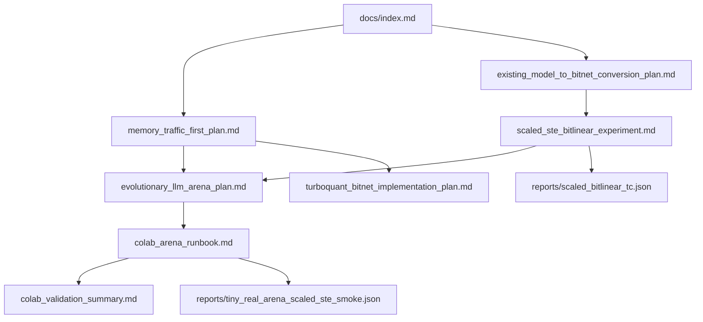

# BitNet-Transformers Research Index

이 문서는 현재 fork에서 진행 중인 BitNet 변환, memory-traffic 최적화,
scaled-STE, Colab 실험 준비 문서의 시작점이다.

## 한 줄 현재 결론

기존 모델을 teacher distillation 없이 BitNet-style ternary 영역으로 바로
내리는 것은 단순 PTQ만으로는 약하지만, S1 `alpha*T` scale을 보존하는
`ScaledBitLinear` + CE-only STE 후학습은 로컬 tiny arena와 Colab seed sweep
모두에서 projected-QAT와 동률~우위를 보이는 첫 native BitLinear-style
후보다.

## 지금 바로 할 일

Colab에서 다음 sweep을 돌린다:

```bash
SCALED_STE_GROUP_SIZE=32 ARENA_JSON_OUT=reports/tiny_real_arena_scaled_ste_colab_g32.json bash scripts/run_colab_scaled_ste_arena.sh
SCALED_STE_GROUP_SIZE=64 ARENA_JSON_OUT=reports/tiny_real_arena_scaled_ste_colab_g64.json bash scripts/run_colab_scaled_ste_arena.sh
SCALED_STE_GROUP_SIZE=128 ARENA_JSON_OUT=reports/tiny_real_arena_scaled_ste_colab_g128.json bash scripts/run_colab_scaled_ste_arena.sh
```

자세한 실행법:

- [Colab Arena Runbook](./colab_arena_runbook.md)
- [Colab Validation Summary](./colab_validation_summary.md)

로컬에서 사전 검정:

```bash
.venv/bin/python scripts/check_scaled_bitlinear.py --json-out reports/scaled_bitlinear_tc.json
.venv/bin/python scripts/run_tiny_real_arena.py --train-steps 200 --json-out reports/tiny_real_arena_scaled_ste_smoke.json --strict
```

## 읽는 순서

처음 읽는다면 이 순서를 추천한다.

1. [Memory-Traffic-First BitNet Plan](./memory_traffic_first_plan.md)
   - 왜 이 프로젝트가 "파라미터 수"보다 "토큰당 이동 byte"를 우선하는지 설명한다.
2. [Existing Model to BitNet Conversion Plan](./existing_model_to_bitnet_conversion_plan.md)
   - 기존 dense checkpoint를 teacher 없이 ternary domain으로 내리는 전체 ladder를 정의한다.
3. [Scaled-STE BitLinear Experiment](./scaled_ste_bitlinear_experiment.md)
   - 현재 가장 중요한 후보인 `ScaledBitLinear`의 수식, TC, 로컬 결과를 정리한다.
4. [Evolutionary LLM Arena Plan](./evolutionary_llm_arena_plan.md)
   - 후보들을 품질만이 아니라 memory/latency/RAM fitness로 비교하는 arena를 설명한다.
5. [Colab Arena Runbook](./colab_arena_runbook.md)
   - 로컬 smoke 이후 Colab에서 크기를 키우는 실행 절차다.
6. [Colab Validation Summary](./colab_validation_summary.md)
   - Colab moderate run과 seed sweep 통과 결과를 기록한다.
7. [TurboQuant + BitNet Implementation Plan](./turboquant_bitnet_implementation_plan.md)
   - weight 변환이 안정화된 뒤 KV cache 압축으로 확장하는 별도 축이다.

## 문서 그래프



## 문서별 역할

| 문서 | 역할 | 언제 읽나 |
| --- | --- | --- |
| [memory_traffic_first_plan.md](./memory_traffic_first_plan.md) | 온디바이스/저자원 LLM에서 병목을 memory traffic으로 정의 | 방향성이 맞는지 판단할 때 |
| [existing_model_to_bitnet_conversion_plan.md](./existing_model_to_bitnet_conversion_plan.md) | 기존 모델 변환 ladder, 금지/허용 범위, TC matrix | 알고리즘 경계를 확인할 때 |
| [scaled_ste_bitlinear_experiment.md](./scaled_ste_bitlinear_experiment.md) | `ScaledBitLinear` 공식, TC, 로컬 결과 | 지금 구현한 핵심 후보를 볼 때 |
| [evolutionary_llm_arena_plan.md](./evolutionary_llm_arena_plan.md) | 후보 선택 fitness, Pareto, arena 결과 | 어떤 후보가 이겼는지 볼 때 |
| [colab_arena_runbook.md](./colab_arena_runbook.md) | Colab 실행 명령, sweep, 결과 해석 | 큰 run을 돌릴 때 |
| [colab_validation_summary.md](./colab_validation_summary.md) | Colab moderate run과 seed sweep milestone 기록 | Colab 결과가 다음 단계 조건을 충족했는지 확인할 때 |
| [turboquant_bitnet_implementation_plan.md](./turboquant_bitnet_implementation_plan.md) | KV cache 압축 계획과 TC | weight 변환 이후 긴 문맥으로 확장할 때 |

## 코드와 문서 연결

| 코드/스크립트 | 관련 문서 | 역할 |
| --- | --- | --- |
| [bitnet_llama/module.py](../bitnet_llama/module.py) | [Scaled-STE BitLinear Experiment](./scaled_ste_bitlinear_experiment.md) | `BitLinear`, `ScaledBitLinear` 레이어 구현 |
| [bitnet_llama/conversion.py](../bitnet_llama/conversion.py) | [Existing Model to BitNet Conversion Plan](./existing_model_to_bitnet_conversion_plan.md) | S0/S1 ternary conversion reference |
| [scripts/check_scaled_bitlinear.py](../scripts/check_scaled_bitlinear.py) | [Scaled-STE BitLinear Experiment](./scaled_ste_bitlinear_experiment.md) | SSTE 수식/gradient TC |
| [scripts/run_tiny_real_arena.py](../scripts/run_tiny_real_arena.py) | [Evolutionary LLM Arena Plan](./evolutionary_llm_arena_plan.md) | 후보별 tiny real-model arena |
| [scripts/run_colab_scaled_ste_arena.sh](../scripts/run_colab_scaled_ste_arena.sh) | [Colab Arena Runbook](./colab_arena_runbook.md) | Colab용 실행 wrapper |
| [scripts/estimate_memory_traffic.py](../scripts/estimate_memory_traffic.py) | [Memory-Traffic-First BitNet Plan](./memory_traffic_first_plan.md) | bytes/token 추정 |

## 리포트 연결

| Report | 생성 명령 | 읽는 법 |
| --- | --- | --- |
| [scaled_bitlinear_tc.json](../reports/scaled_bitlinear_tc.json) | `scripts/check_scaled_bitlinear.py` | S1 `alpha*T` equivalence와 STE gradient가 통과했는지 확인 |
| [tiny_real_arena_scaled_ste_smoke.json](../reports/tiny_real_arena_scaled_ste_smoke.json) | `scripts/run_tiny_real_arena.py --train-steps 200 --strict` | scaled-STE가 projected-QAT와 fp16 dense 대비 어떤 위치인지 확인 |
| [tiny_real_arena_ste_qat_smoke.json](../reports/tiny_real_arena_ste_qat_smoke.json) | 이전 BitLinear STE smoke | scale 없는 STE가 왜 약한지 비교 |
| [tiny_real_arena_qat_smoke.json](../reports/tiny_real_arena_qat_smoke.json) | projected-QAT smoke | scaled-STE의 비교 기준 |
| [memory_traffic_bitllama_512x4.json](../reports/memory_traffic_bitllama_512x4.json) | `scripts/estimate_memory_traffic.py` | weight/KV policy별 bytes/token 추정 |

## 현재 실험 상태

완료:

- BitLinear ternarization 버그와 용어 혼동 정리
- S0/S1 conversion reference 구현
- tiny real-model arena 구현
- projected-QAT 후보 구현
- scale 없는 `BitLinear` STE 후보 구현 및 한계 확인
- S1 scale을 보존하는 `ScaledBitLinear` 구현
- scaled-STE TC 및 local strict smoke 통과
- Colab runner와 runbook 작성
- Colab faster smoke, moderate arena, seed sweep `31/32/33` 통과
- scaled-STE quality winner `3/3`, Pareto frontier 조건 충족

다음:

1. `SCALED_STE_GROUP_SIZE` sweep: `32`, `64`, `128`.
2. `SCALED_STE_ACTIVATION_BITS` sweep: `0`, `8`.
3. Colab sweep JSON을 `reports/`로 회수해 commit.
4. 결과가 안정적이면 synthetic patterned data에서 tiny real text subset으로 이동.
5. 이후 packed ternary kernel, export, TurboQuant 중 우선순위를 고른다.

이전 보류 항목에서 진입 조건을 충족한 다음 phase 후보:

- packed ternary kernel
- GGUF/bitnet.cpp export
- TurboQuant KV cache 구현

단, raw Colab seed JSON이 현재 local workspace에 없으므로 논문식 정량 주장 전에는
보고서를 회수하거나 sweep을 재실행한다.
