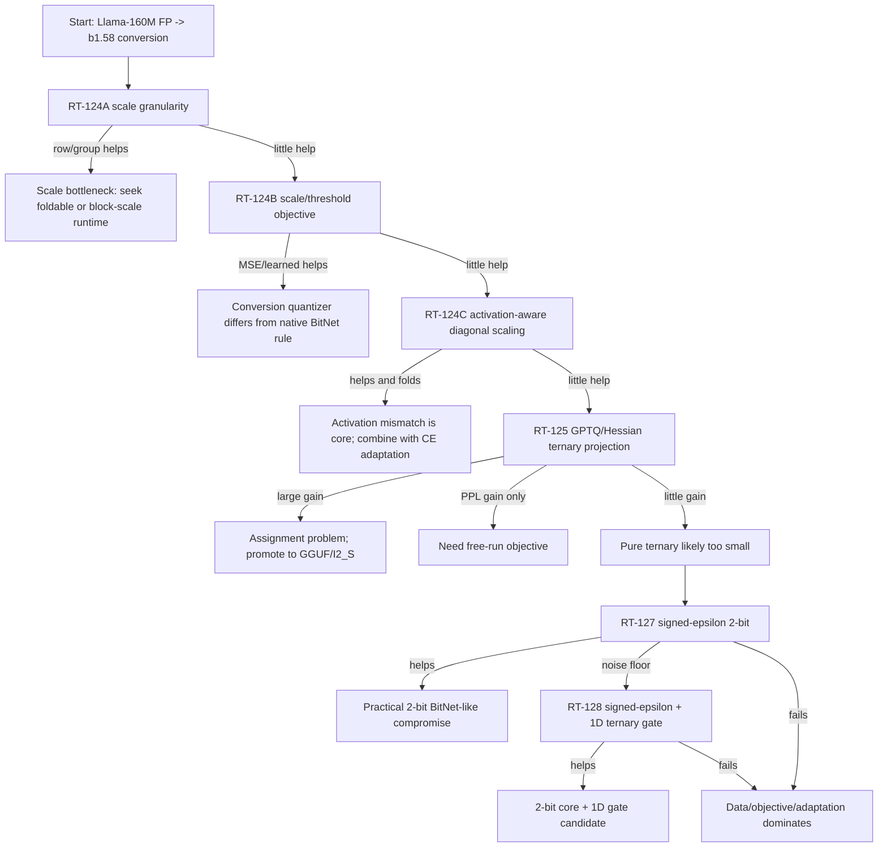

# Quantization-Aware b1.58 Conversion Plan (RT-124..128)

Document position: [Index](./index.md) -> after
[Why Existing Models Resist b1.58 Conversion](./why_b158_conversion_is_hard.md).

Related:

- [Quality Recovery Plan](./quality_recovery_plan.md)
- [G5 Baseline Comparison Plan](./g5_baseline_plan.md)
- [Mixed-Bit DP Plan](./mixed_bit_dp_plan.md)
- [Paper Skeleton](./paper_skeleton.md)

## Purpose

The project started with a simple question:

```text
Can an existing FP/BF16 LLM be converted into a BitNet-like b1.58 model
the way ordinary quantization converts a model?
```

The systems half is mostly solved on x86/Linux:

- `Wq = gamma*T`, `T in {-1,0,+1}`, exports faithfully to I2_S when `Wq` is
  materialized before GGUF conversion.
- I2_S storage and token-generation speed improve with model scale.
- I2_S preserves adapted F16 quality within a small CE delta.

The quality half is not solved:

- one-shot ternary PTQ collapses;
- teacher-free CE recovery helps a lot but does not beat Q2_K on PPL;
- 1.1B greedy generation still degenerates after all-I2_S adaptation;
- RT-123 showed that naive mixed-bit/additive DP is interaction-dominated.

This document defines the next experiment: **borrow the real post-training
quantization toolbox before declaring b1.58 conversion impossible.**

## Central Question

The next experiments should decide which of these explanations is true:

```text
A. We failed because the quantizer was too primitive.
B. We failed because b1.58 needs activation-aware / Hessian-aware assignment.
C. We failed because layer interaction requires adaptation under the final topology.
D. Pure {-1,0,+1} b1.58 is too small for existing-model conversion, so a 2-bit
   signed-epsilon compromise is needed.
```

The goal is not to prove every method. The goal is to force the project into one of
the branches above with data.

## Non-Negotiable Rules

1. **Use Llama-160M first.**
   It is cheap, already instrumented, and RT-121/122 baselines exist.
2. **Separate quality reference from runtime export.**
   PyTorch reference is allowed for fast screening. Only promote winners to GGUF/I2_S.
3. **Do not use PPL alone.**
   Every promoted candidate must report prompt-panel or loop-rate signals.
4. **Keep runtime cost visible.**
   A method that improves PPL by adding dense matmuls may be scientifically useful,
   but it does not solve the low-resource inference goal.
5. **Do not overclaim against Q2_K.**
   RT-121 says Q2_K beats current OURS on PPL. A new method must re-earn that claim.

## Fixed Baselines

Use the same baseline table as RT-121 whenever possible:

| ID | Method | Role |
| --- | --- | --- |
| FP | F16/F32 dense model | quality reference |
| PTQ-b1.58 | one-shot `gamma*T` | collapse baseline |
| OURS-old | teacher-free CE, linears-only, per-tensor b1.58 | current best all-I2_S |
| Q2_K | llama.cpp ~2.6-bit one-shot | reviewer baseline |
| Q3_K_M/Q4_0 | higher-bit one-shot | quality upper reference |

The first model is `JackFram/llama-160m`. Promote only strong winners to
`TinyLlama/TinyLlama-1.1B-*`.

## Quantization Option Matrix

The experiment should treat "b1.58 conversion" as a quantizer design problem. The
first sweep should make these choices explicit:

| Axis | Options | First-pass decision |
| --- | --- | --- |
| symmetry | symmetric / asymmetric zero-point | start symmetric; asymmetric is diagnostic only because BitNet/I2_S has no affine zero-point path |
| codebook | `{-1,0,+1}` / `{-1,-eps,+eps,+1}` | start pure ternary, move to signed-epsilon only after pure b1.58 is fairly tested |
| scale granularity | per-tensor / row-wise / column-wise / groupwise / blockwise | sweep as RT-124A |
| scale objective | absmean / MSE / activation-MSE / learned | sweep as RT-124B |
| threshold | fixed `lambda*gamma` / percentile / learned | sweep with scale objective |
| assignment | nearest / stochastic / activation-MSE / GPTQ-style compensation | nearest first, GPTQ-style in RT-125 |
| calibration | weight-only / activation-aware / Hessian-aware | escalate in that order |
| runtime class | I2_S-compatible / foldable / upper-bound / custom-kernel | report for every candidate |

Why symmetric first:

```text
BitNet-style speed comes from signed low-bit arithmetic, not affine int quantization.
An asymmetric zero-point can improve reconstruction, but it does not map naturally to
I2_S add/sub semantics. Use it only to estimate an upper bound, not as the default path.
```

Why channel/group scales matter:

```text
If per-channel or groupwise scale closes much of the quality gap, the failure was not
"b1.58 cannot represent the model" but "one scale per whole matrix is too crude."
```

## Metrics

Minimum metrics for every experiment:

```text
CE / PPL
residual_gap = CE(candidate) - CE(FP)
candidate_vs_Q2K CE/PPL
target-linear bits or MB proxy
runtime-compatibility class
```

Minimum metrics for promoted candidates:

```text
prompt-panel tags: ok / repetitive / loop / salad / empty
unique-token ratio
repeated-ngram rate
adapted F16 vs I2_S parity if exported
```

Interpretation rule:

```text
PPL improvement without generation improvement is not enough.
generation improvement without runtime feasibility is a research note, not the product path.
```

## Phase 0: Reproducible Setup

Goal: make every later result comparable.

Required artifacts:

```text
reports/rt121_baseline_panel.json
reports/rt122_panel_1p1b_summary.json
reports/rt123_sensitivity_160m.json
fixed eval.txt used by llama-perplexity
fixed prompt panel used by RT-119/122
```

If a Colab runtime is fresh:

```bash
git clone https://github.com/gtpk/BitNet-Transformers /content/bnt
cd /content/bnt
git fetch origin
git reset --hard origin/main
```

If `bitnet.cpp` is needed, prefer the previously validated x86 route:

```text
setup_env.py -q i2_s
```

Do not trust Mac M5 I2_S/TL1 results for ternary runtime decisions.

## Phase 1: RT-124A Scale Granularity Sweep

Question:

```text
Did per-tensor gamma make b1.58 look worse than it really is?
```

Candidates:

| Candidate | Scale granularity | Runtime status |
| --- | --- | --- |
| per-tensor | one gamma per matrix | I2_S-compatible |
| row-wise | one gamma per output channel | quality upper bound |
| column-wise | one gamma per input channel | maybe foldable via activation scaling |
| groupwise-64/128 | one gamma per row group | quality upper bound; custom runtime likely |
| blockwise-128 | align with I2_S block size | possible future runtime compromise |

Measure:

```text
min over gamma,T of ||W - gamma*T|| and, more importantly,
CE/PPL after materializing each candidate in PyTorch.
```

Pass/branch:

```text
If row/group/block scales greatly improve CE:
  conclusion = scale granularity bottleneck.
  next = look for foldable scaling or custom block-scale runtime.

If no scale granularity helps:
  conclusion = codebook/assignment/layer interaction is the bottleneck.
  next = RT-124B/125.
```

## Phase 2: RT-124B Scale And Threshold Objective Sweep

Question:

```text
Is BitNet's native absmean rule the wrong rule for conversion?
```

Candidates:

```text
gamma = mean(abs(W))                         # current BitNet-style rule
gamma = argmin ||W - gamma*T||^2             # MSE-optimal
gamma, threshold = percentile/clipped search
gamma, lambda learned on calibration CE
activation-MSE scale: min ||XW - X(gamma*T)||^2
```

Ternary assignment:

```text
T_ij = sign(W_ij) if abs(W_ij) > threshold else 0
```

Pass/branch:

```text
If MSE/activation-MSE scale beats absmean materially:
  conclusion = native-training quantizer is not the right conversion quantizer.
  next = promote the best objective into QR-style adaptation.

If all threshold/scale variants remain close:
  conclusion = assignment/codebook or inter-layer interaction dominates.
  next = RT-125.
```

## Phase 3: RT-124C Activation-Aware Diagonal Scaling

Question:

```text
Can AWQ/SmoothQuant-style equivalent scaling make W easier to ternarize
without adding inference matmuls?
```

Core identity:

```text
XW = (XD)(D^-1 W)
```

Choose diagonal `D` from calibration activations so that `D^-1 W` becomes more
ternary-friendly while the full-precision function is unchanged before quantization.

Search:

```text
D_j = activation_stat_j^alpha
alpha in {0.0, 0.25, 0.5, 0.75, 1.0}
optional clipping of D
```

References:

- AWQ: activation-aware channel scaling for weight quantization
  ([arXiv:2306.00978](https://arxiv.org/abs/2306.00978))
- SmoothQuant: migrating activation outlier difficulty into weights
  ([arXiv:2211.10438](https://arxiv.org/abs/2211.10438))

Pass/branch:

```text
If diagonal scaling improves CE and prompt loops without runtime-heavy leftovers:
  conclusion = activation distribution mismatch is a major cause.
  next = combine with RT-124B best scale and QR adaptation.

If diagonal scaling improves PyTorch but cannot be folded/exported:
  conclusion = research signal only; track runtime overhead honestly.

If no improvement:
  next = Hessian/GPTQ-style assignment.
```

## Phase 4: RT-125 Hessian/GPTQ-Style Ternary Projection

Question:

```text
Can output-aware assignment rescue b1.58 where nearest rounding fails?
```

Current projection optimizes weight statistics:

```text
min ||W - gamma*T||^2
```

GPTQ-style projection optimizes layer output:

```text
min ||XW - X(gamma*T)||^2
approximately min (W - gamma*T)^T H (W - gamma*T), H = X^T X
```

Reference:

- GPTQ: second-order post-training quantization
  ([arXiv:2210.17323](https://arxiv.org/abs/2210.17323))

Minimum implementation:

```text
collect calibration activations X per target linear
solve row/block ternary assignment with activation-MSE objective
try sequential error compensation only after the simple activation-MSE version works
```

Pass/branch:

```text
If GPTQ-style ternary closes a large fraction of the Q2_K gap:
  conclusion = assignment problem, not fundamental b1.58 impossibility.
  next = combine with short CE adaptation and export.

If it improves CE but generation still loops:
  conclusion = teacher-forced layer reconstruction is insufficient.
  next = free-run/repetition-aware adaptation.

If it barely helps:
  conclusion = pure ternary codebook may be too small for conversion.
  next = RT-127 signed-epsilon.
```

## Phase 5: RT-126 Rotation / Incoherence Preconditioning

Question:

```text
Are outliers and coordinate-axis alignment making ternary assignment unusually hard?
```

Candidates:

```text
fixed Hadamard rotations
random orthogonal rotations
foldable residual/MLP rotations only
```

References:

- QuIP: incoherence processing for 2-bit LLM quantization
  ([arXiv:2307.13304](https://arxiv.org/abs/2307.13304))
- QuaRot: rotation-based outlier-free quantization
  ([arXiv:2404.00456](https://arxiv.org/abs/2404.00456))
- SpinQuant: learned rotations for LLM quantization
  ([arXiv:2405.16406](https://arxiv.org/abs/2405.16406))

Branch:

```text
If fixed/foldable rotations help:
  use them as preprocessing before b1.58 projection.

If only learned online rotations help:
  classify as quality research, but likely not the low-resource runtime path.
```

## Phase 6: RT-127 Signed-Epsilon 2-Bit Codebook

Question:

```text
Is the zero-heavy ternary codebook deleting too many small signed connections?
```

Candidate:

```text
S_epsilon in {-1, -epsilon, +epsilon, +1}
Wq = gamma*S_epsilon
epsilon in {1/16, 1/8, 1/4, learned}
```

This is no longer pure b1.58. It is a practical 2-bit compromise. It is close to
2-bit scaled-binary quantization, where:

```text
Wq = alpha*s1 + beta*s2, s1,s2 in {-1,+1}
codebook = {-(alpha+beta), -(alpha-beta), +(alpha-beta), +(alpha+beta)}
```

Reference:

- Least Squares Binary Quantization
  ([arXiv:2001.02786](https://arxiv.org/abs/2001.02786))

Branch:

```text
If signed-epsilon fixes PPL and loop-rate:
  conclusion = pure b1.58 codebook is too lossy for conversion.
  next = design a runtime path or map to an existing 2-bit quant type.

If signed-epsilon improves reconstruction but not generation:
  conclusion = codebook helps but free-run stability remains the blocker.

If signed-epsilon does not help:
  conclusion = data/objective/adaptation dominates codebook.
```

## Phase 7: RT-128 Signed-Epsilon + 1D Ternary Gate

Question:

```text
Can we keep the signed small connections while reintroducing cheap structural zero?
```

Candidate:

```text
W_eff = gamma * S_epsilon * diag(g_in)
g_in in {-1,0,+1}
```

or:

```text
W_eff = gamma * diag(g_out) * S_epsilon * diag(g_in)
```

What it can solve:

```text
signed-epsilon has no exact zero -> noise floor.
1D gate can zero whole channels cheaply.
```

What it cannot solve:

```text
arbitrary 2D sparsity patterns.
high-rank residual correction.
sign mistakes on individual important weights.
```

Branch:

```text
If gate sparsity reduces loop/noise without much PPL loss:
  promote as "2-bit core + 1D ternary control" architecture.

If gate collapses many channels and hurts quality:
  signed-epsilon alone is the cleaner compromise.

If neither works:
  return to adaptation/data objectives, not codebook engineering.
```

## Decision Tree



## Promotion Criteria

A candidate can move from PyTorch probe to runtime/export only if it satisfies:

```text
CE/PPL improves over OURS-old all-I2_S
loop/salad/empty rate improves on prompt panel
storage/runtime proxy remains meaningfully below Q2_K or clearly faster than Q2_K
method does not require dense residual matmul at every token
```

Strong promotion:

```text
candidate PPL <= Q2_K or prompt panel >= Q2_K tier
and candidate target-linear bytes < Q2_K
and runtime path is plausible
```

Fail-fast:

```text
candidate improves reconstruction but worsens generation
candidate improves quality only by adding dense online compute
candidate requires per-weight metadata that destroys memory-traffic benefit
```

## Expected Conclusions

This plan should produce one of four useful outcomes:

1. **Pure b1.58 is salvageable with quantization-aware conversion.**
   Then the paper becomes a stronger conversion method paper.
2. **Pure b1.58 is only a systems substrate; quality needs higher-bit pockets.**
   Then mixed-bit or 2-bit compromise is the honest product path.
3. **Signed-epsilon 2-bit is the right compromise.**
   Then the claim shifts from "1.58-bit conversion" to "BitNet-like 2-bit
   memory-traffic-first conversion."
4. **None of the quantization tricks fixes generation.**
   Then the honest conclusion is that existing-model conversion needs longer
   adaptation, better data, or native-ish training schedules; runtime/export remains
   a solved substrate.

## Colab Handoff

For a copy-paste prompt to give another AI agent that can run Colab, see
[Colab Quantization-Aware Conversion Prompt](./colab_quantization_aware_prompt.md).

## RT-124A RESULT (2026-06-25): scale granularity is a real but PARTIAL lever; codebook dominates

PyTorch one-shot ternary screen on Llama-160M (`scripts/rt124a_scale_granularity.py`,
`reports/rt124a_scale_granularity_160m.json`). CE_fp = 3.15 (PPL 23).

| granularity | CE | PPL | recon rel-L1 | vs per-tensor | runtime |
| --- | ---: | ---: | ---: | ---: | --- |
| per_tensor | 11.66 | 115,808 | 0.452 | — | I2_S-native |
| row (per-output-ch) | 9.82 | 18,422 | 0.448 | +1.84 | foldable (scale ternary-matmul output) |
| col (per-input-ch) | 11.73 | 124,839 | 0.451 | -0.08 | no help |
| group128 (block) | 9.30 | 10,935 | 0.447 | **+2.36** | needs per-block-scale runtime |
| group64 | 9.30 | 10,935 | 0.447 | +2.36 | custom runtime |

Findings:
1. **Finer scale helps, partially.** per-tensor -> group128 recovers +2.36 nats one-shot;
   so per-tensor gamma did understate b1.58. Scale granularity is a genuine lever.
2. **But it does not rescue.** The best (group128, PPL 10,935) is still catastrophic vs
   FP (23) and far worse than the CE-ADAPTED all-I2_S per-tensor model (PPL ~114 at
   160M). One-shot scale alone is not usable; **training is still the bigger lever.**
3. **Residual is codebook-dominated.** recon rel-L1 is ~0.45 at EVERY granularity — the
   ternary {-1,0,+1} codebook deletes ~45% of weight magnitude regardless of scale. So
   the next probe is the codebook/threshold/objective (RT-124B), not finer scale.
4. **Deployability split.** row = per-output-channel scale is FOLDABLE (scale the
   ternary-matmul output vector) and cheap — a deployable +1.84-nat lever worth keeping.
   group/block scale (+2.36) needs a per-block-scale runtime (I2_S stores one per-tensor
   scale); col scale does not help.

```text
VERDICT (RT-124A): scale granularity is a real, partial lever (≈+1.8 nats deployable
via per-output-channel scale; +2.4 with block scale + custom runtime), but it does NOT
make one-shot b1.58 usable and the residual is codebook-dominated. Carry per-output-
channel scale forward as a cheap improvement; the main next probe is RT-124B (MSE/
threshold objective) to attack the ~45% magnitude the ternary codebook deletes.
```

## RT-124B RESULT (2026-06-25): absmean is already best; the objective is NOT the bottleneck

PyTorch one-shot ternary screen, per-tensor (`scripts/rt124b_scale_threshold.py`,
`reports/rt124b_scale_threshold_160m.json`). CE_fp = 3.15.

| method | CE | PPL | nonzero frac | vs absmean |
| --- | ---: | ---: | ---: | ---: |
| absmean (BitNet rule) | 11.66 | 115,808 | 0.686 | — |
| mse_scale (LS gamma) | 11.95 | 155,203 | 0.686 | -0.29 |
| thresh_search (grid tau) | 12.07 | 173,953 | 0.519 | -0.41 |
| act_mse (diag X^TX, crude) | 12.12 | 183,136 | 0.531 | -0.46 |

Finding: **the native absmean rule is already near-optimal** for the per-tensor
scale/threshold. Minimizing weight reconstruction ||W-gamma*T||^2 (mse_scale) actually
HURTS CE — weight-MSE is not output/CE. Lowering the threshold to zero more weights
hurts (absmean's 0.69 nonzero beats the sparser 0.52). A crude diagonal activation-MSE
also hurts (a proper version is RT-124C/125).

```text
VERDICT (RT-124B): the scale/threshold OBJECTIVE is not the bottleneck — absmean wins.
Per the decision tree, the bottleneck is the ASSIGNMENT / activation-awareness /
inter-layer interaction. Next: RT-124C (AWQ/SmoothQuant diagonal equivalent scaling),
then RT-125 (GPTQ/Hessian output-aware ternary projection).
```

## RT-124C RESULT (2026-06-25): activation-aware diagonal scaling does NOT rescue

PyTorch screen, XW=(XD)(D^-1 W), D_j = act_rms_j^alpha (`scripts/rt124c_activation_scaling.py`).

| alpha | CE | PPL | vs alpha0 |
| ---: | ---: | ---: | ---: |
| 0.0 (baseline) | 11.66 | 115,808 | — |
| 0.25 | 11.81 | 134,672 | -0.15 |
| 0.5 | 11.80 | 133,620 | -0.14 |
| 0.75 | 11.52 | 100,407 | +0.14 |
| 1.0 | 11.77 | 128,778 | -0.11 |

Best (alpha 0.75) recovers only +0.14 nats — marginal, below the 0.2 bar; consistent
with RT-124A's col-scale being unhelpful (D is a per-input-channel scale). Activation-
outlier migration is not the dominant cause of ternary difficulty here.

```text
VERDICT (RT-124C): activation-aware diagonal scaling is not the rescue. RT-124 as a
whole: only scale GRANULARITY (block/row) is a real partial lever (+1.8-2.4 nats, needs
runtime); the scale/threshold OBJECTIVE (absmean already best) and ACTIVATION diagonal
scaling do not help. The remaining untested lever is output-aware ASSIGNMENT -> RT-125
(GPTQ/Hessian ternary projection): minimize ||XW - X(gamma*T)||^2 with second-order
error compensation, capturing inter-weight interactions diagonal methods miss.
```

## RT-125 RESULT (2026-06-25): assignment matters a little; pure ternary one-shot is fundamentally too lossy

PyTorch screening GPTQ (H from one FP pass, non-sequential, per-tensor gamma, ternary;
`scripts/rt125_gptq_ternary.py`). CE_fp 3.15.

| method | CE | PPL |
| --- | ---: | ---: |
| nearest (per-tensor absmean) | 11.66 | 115,808 |
| GPTQ (Hessian output-aware) | 11.15 | 69,523 |

GPTQ beats nearest by **+0.51 nats** (assignment is a real lever) but closes only
**6%** of the nearest->FP gap. Combined with RT-124 (block-scale +2.4 nats; objective
and activation-diagonal no help), the full one-shot PTQ toolbox cannot make PURE
ternary usable — the best stack still leaves PPL in the thousands, vs FP 23 and the
CE-adapted all-I2_S model 114. Training stays the dominant lever.

```text
VERDICT (RT-125 + RT-124 synthesis): one-shot PURE {-1,0,+1} ternary is fundamentally
too lossy for conversion, regardless of scale granularity, scale/threshold objective,
activation-aware scaling, or GPTQ/Hessian assignment. Assignment helps a little (+0.51),
but the codebook is the wall. Per the decision tree this points to RT-127 (signed-
epsilon 2-bit): is the zero-heavy ternary codebook deleting too many small signed
connections? (RT-126 rotation skipped for now — a stronger assignment method, GPTQ,
already gained only 6%, so outlier/incoherence is unlikely to be the rescue.)
```

## RT-127 RESULT + TRACK SYNTHESIS (2026-06-25): the quantizer is not the bottleneck; adaptation/data is

RT-127 signed-epsilon 2-bit codebook ({-1,-eps,+eps,+1}, per-tensor gamma MSE-searched;
`scripts/rt127_signed_epsilon.py`). CE_fp 3.15, ternary 11.66.

| codebook | eps | CE | PPL |
| --- | --- | ---: | ---: |
| ternary {-1,0,1} | — | 11.66 | 115,808 |
| signed-eps | 0.125 | 12.47 | 260,024 |
| signed-eps | 0.25 | 11.78 | 130,547 |
| signed-eps | 0.333 | 12.05 | 171,742 |
| signed-eps | 0.5 | 12.38 | 237,186 |

**No signed-epsilon variant beats one-shot ternary** — all are slightly worse.
Replacing the zero with small signed +/-eps does not help; the zero level is fine and
the codebook size is not the one-shot blocker.

### Quantization-aware track synthesis (RT-124A/B/C, RT-125, RT-127)

| lever | one-shot effect on Llama-160M |
| --- | --- |
| scale granularity (block/row) | +1.8 to +2.4 nats — partial lever, needs runtime; row is foldable |
| scale/threshold objective | absmean already best (MSE/threshold HURT) |
| activation diagonal (AWQ/SmoothQuant) | +0.14 nats — no rescue |
| GPTQ/Hessian assignment | +0.51 nats — only 6% of the nearest->FP gap |
| signed-epsilon 2-bit codebook | does NOT beat ternary |

```text
CONCLUSION (quantization-aware track = plan's Expected Conclusion #4):
None of the PTQ toolbox levers — scale granularity, scale/threshold objective,
activation-aware diagonal scaling, GPTQ/Hessian assignment, or a richer 2-bit codebook
— rescues one-shot conversion of an existing FP LLaMA to ~2-bit. The best stack closes
well under half the gap and stays at PPL in the thousands. The bottleneck is NOT the
quantizer; it is ADAPTATION/DATA. Per-tensor absmean ternary + short teacher-free CE
(RT-116) already beats every one-shot quantizer trick (adapted 160M PPL ~114 vs best
one-shot ~10k), and the remaining usability gap (RT-122 generation degeneration) is a
recovery/data/objective problem, not a quantizer-design problem.

Implications:
- Stop optimizing the one-shot quantizer; per-tensor absmean ternary is a fine init.
- Carry forward only the cheap deployable lever: per-output-channel (row) scale (+1.8
  nats one-shot, foldable) as an optional init improvement.
- The next real lever for usability is on the ADAPTATION/DATA side: longer/better-data
  CE, repetition-aware / free-run objectives, instruction data — NOT more bit/codebook
  engineering. Runtime/export remains a solved substrate (systems track).
- Mixed-bit (RT-123) and 2-bit codebook (RT-127) are both demoted: neither is the lever.
```
